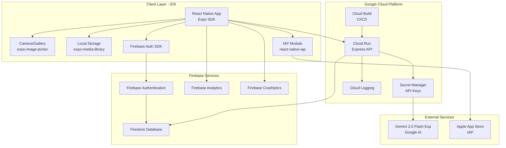
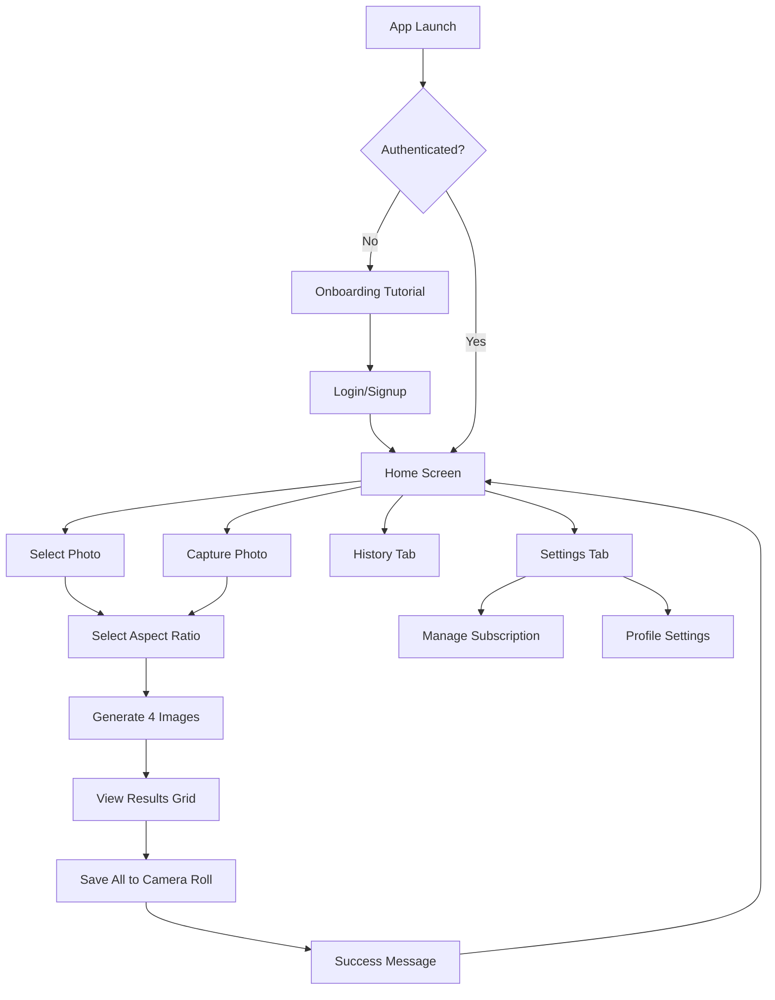
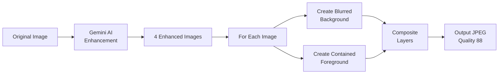
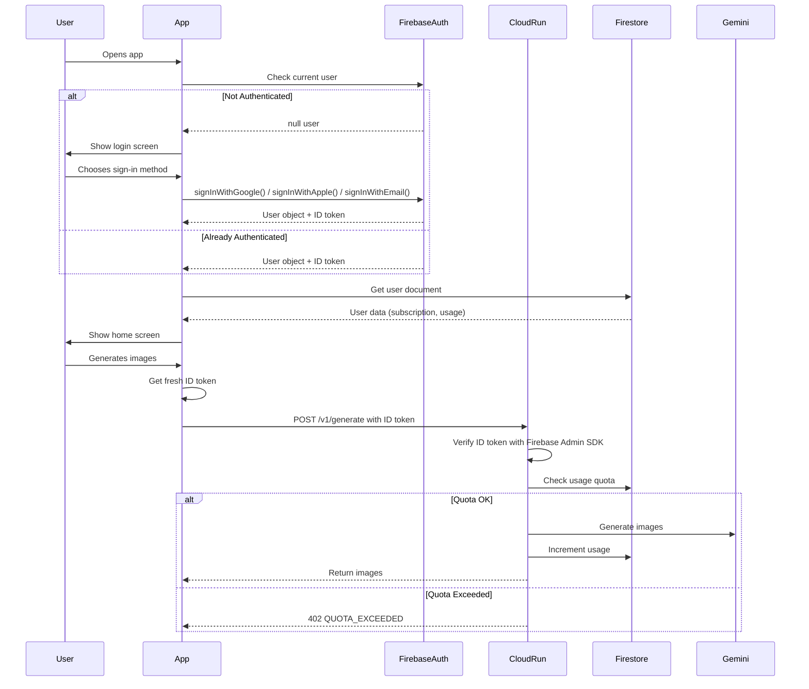
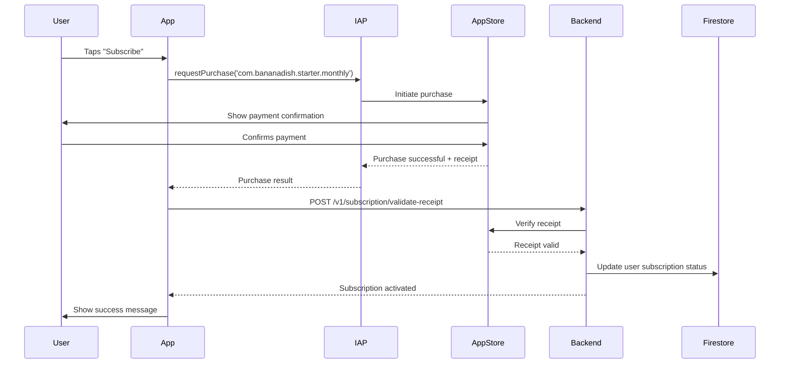
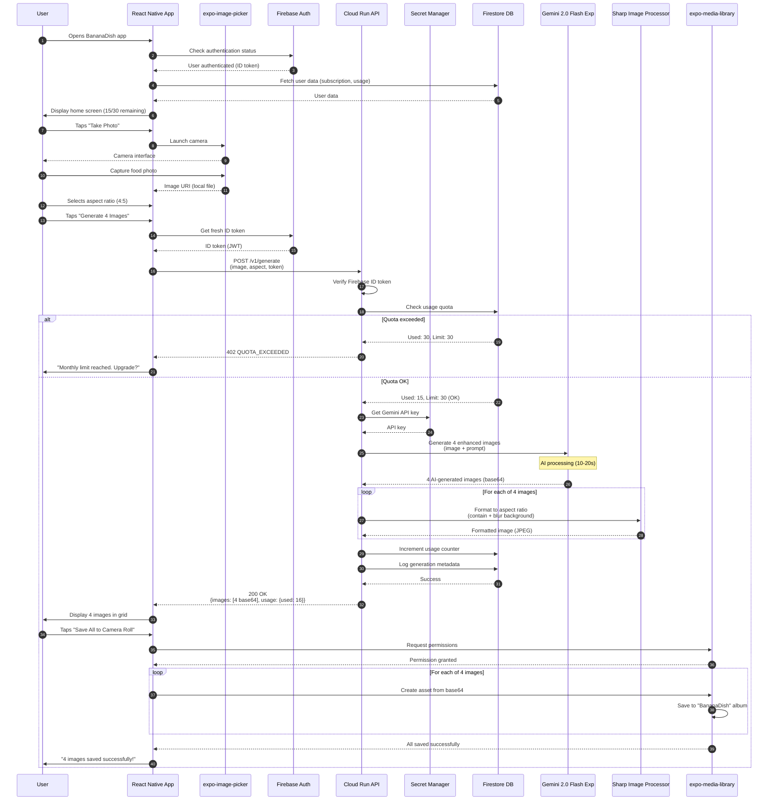
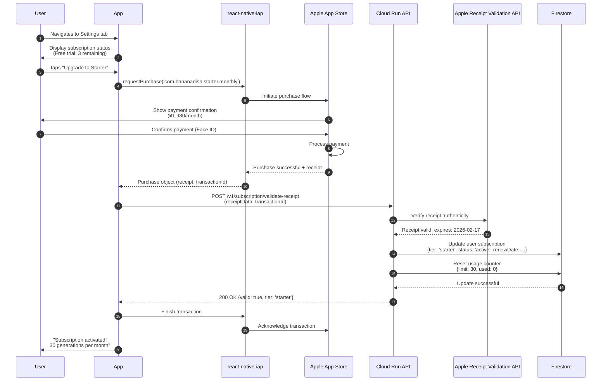

# BananaDish Technical Design Document

## Document Information

| Item | Details |
|------|---------|
| Product Name | BananaDish |
| Version | 1.0.0 |
| Created Date | 2026-01-17 |
| Status | Draft |
| Author | Technical Architecture Team |
| Related Documents | [PRD](/docs/prd/bananadish-prd.md), [App Idea](/docs/ideas/appidea.md) |

---

## Executive Summary

BananaDish is an AI-powered mobile application that transforms restaurant food photography into professional, social media-ready images. This document outlines the technical architecture, design decisions, and implementation approach for the MVP release targeting iOS devices.

### Key Technical Decisions

- **Frontend**: React Native (Expo) for cross-platform foundation with iOS-first launch
- **Backend**: Node.js on Cloud Run for serverless, auto-scaling API proxy
- **AI Service**: Gemini 2.0 Flash Exp (Nano Banana) for food photo enhancement
- **Authentication**: Firebase Auth with email, Google, and Apple Sign-In
- **Database**: Firestore for user and subscription data
- **Payment**: Apple In-App Purchase for iOS subscriptions

---

## Existing Codebase Analysis

**Status**: This is a greenfield project with no existing codebase.

**Similar Functionality Search**: No existing implementations found. This is a new application being built from scratch.

**Decision**: Proceed with new implementation following modern best practices for React Native, Cloud Run, and Firebase ecosystems as of 2026.

---

## Agreement Checklist

Based on the PRD and requirements, the following agreements are established:

### Scope (What to Build)
- ✅ iOS mobile application using React Native (Expo)
- ✅ Photo capture/selection functionality
- ✅ AI enhancement generating exactly 4 images per input
- ✅ Aspect ratio control (4:5, 9:16, 16:9, 1:1) with no-crop "contain + blur" method
- ✅ Batch save all 4 images to camera roll
- ✅ Firebase Authentication (Email, Google, Apple Sign-In)
- ✅ Subscription system via Apple In-App Purchase
- ✅ Usage quota tracking (30 generations/month for Starter tier)
- ✅ Cloud Run backend as API proxy to protect Gemini API key

### Non-Scope (What NOT to Build for MVP)
- ❌ Android application (React Native foundation prepared but not launched)
- ❌ Multi-language support (Japanese only)
- ❌ Manual photo editing tools
- ❌ Cloud storage of generated images
- ❌ Team collaboration features
- ❌ Direct social media sharing (save to camera roll only)
- ❌ Batch processing (multiple photos in one session)

### Constraints
- **Security**: Gemini API key MUST NOT be embedded in client app - all AI requests proxied through backend
- **Image Quality**: No cropping allowed - use "contain + blurred background" for aspect ratio formatting
- **Output Count**: Always generate exactly 4 images (implement retry if fewer returned)
- **Performance**: 90th percentile generation time < 30 seconds
- **Compatibility**: iOS 14.0+ support
- **Cost**: Target < ¥50,000/month infrastructure cost for first 500 users

### Performance Requirements
- **Response Time**: Generation completion 90th percentile < 30 seconds
- **App Launch**: < 2 seconds to home screen
- **Image Save**: < 3 seconds for all 4 images
- **Reliability**: App crash rate < 0.5%, generation success rate > 95%
- **Uptime**: Backend uptime 99.5% (excluding maintenance)

### Reflection Confirmation
- [x] Security constraint reflected in architecture (3-tier: Client → Cloud Run → Gemini)
- [x] No-crop constraint reflected in image processing pipeline design
- [x] Performance requirements reflected in NFR section and API design
- [x] All scope items mapped to functional requirements in PRD
- [x] Non-scope items explicitly excluded from architecture

---

## Architecture Overview

### System Architecture Diagram



### Component Overview

| Layer | Component | Technology | Responsibility |
|-------|-----------|------------|----------------|
| **Client** | Mobile App | React Native (Expo) | UI, camera access, local storage, user interaction |
| **Client** | State Management | React Context + Hooks | App state, authentication state, generation status |
| **Client** | Image Picker | expo-image-picker | Camera/gallery integration |
| **Client** | Media Library | expo-media-library | Save images to device |
| **Authentication** | Firebase Auth | Firebase Auth SDK | User identity, token generation |
| **Backend** | API Proxy | Cloud Run (Node.js + Express) | Request validation, AI orchestration, quota management |
| **Backend** | Image Processor | Sharp library | Aspect ratio formatting, blur background generation |
| **Database** | User Data | Firestore | User profiles, subscription status, usage tracking |
| **AI** | Image Generation | Gemini 2.0 Flash Exp | Food photo enhancement |
| **Payment** | Subscription | Apple IAP | Billing, receipt validation |
| **Monitoring** | Analytics | Firebase Analytics | User behavior tracking |
| **Monitoring** | Error Tracking | Firebase Crashlytics | App crash reporting |
| **Monitoring** | Backend Logs | Cloud Logging | API request logs, errors |

---

## Frontend Design (React Native / Expo)

### Project Structure

```
bananadish-app/
├── app/                          # Expo Router (file-based routing)
│   ├── (auth)/                   # Authentication screens group
│   │   ├── login.tsx
│   │   ├── signup.tsx
│   │   └── _layout.tsx
│   ├── (tabs)/                   # Main app tabs group
│   │   ├── home.tsx              # Camera/generation screen
│   │   ├── history.tsx           # Generation history
│   │   ├── settings.tsx          # Settings & subscription
│   │   └── _layout.tsx
│   ├── onboarding.tsx            # First-time user tutorial
│   └── _layout.tsx               # Root layout
├── components/                   # Reusable components
│   ├── ImageGrid.tsx             # 4-image result grid
│   ├── AspectRatioSelector.tsx   # Aspect ratio picker
│   ├── GenerationProgress.tsx    # Loading indicator
│   └── SubscriptionCard.tsx      # Subscription info display
├── services/                     # Business logic
│   ├── api/
│   │   ├── client.ts             # API client configuration
│   │   ├── generation.ts         # Generation API calls
│   │   └── subscription.ts       # Subscription API calls
│   ├── auth/
│   │   └── firebase.ts           # Firebase Auth wrapper
│   ├── storage/
│   │   └── mediaLibrary.ts       # Camera roll save logic
│   └── iap/
│       └── purchaseManager.ts    # IAP integration
├── hooks/                        # Custom React hooks
│   ├── useAuth.ts                # Authentication state
│   ├── useGeneration.ts          # Generation flow state
│   ├── useSubscription.ts        # Subscription status
│   └── useMediaPermissions.ts    # Camera/storage permissions
├── contexts/                     # React Context providers
│   ├── AuthContext.tsx
│   └── SubscriptionContext.tsx
├── types/                        # TypeScript type definitions
│   ├── api.ts
│   ├── user.ts
│   └── subscription.ts
├── constants/
│   ├── config.ts                 # App configuration
│   └── strings.ts                # Japanese UI strings
└── app.json                      # Expo configuration
```

### Screen Flow and Navigation



### Key Screen Specifications

#### Home Screen (Main Generation Flow)
- **Purpose**: Primary user interaction for photo enhancement
- **Components**:
  - Camera preview or image placeholder
  - "Take Photo" button (opens camera)
  - "Choose from Library" button (opens gallery)
  - Aspect ratio selector (4:5 default, 9:16, 16:9, 1:1)
  - Usage counter display (e.g., "15 / 30 remaining this month")
- **State Management**: `useGeneration` hook
- **Permissions Required**: Camera, Photo Library

#### Generation Progress Screen
- **Purpose**: Feedback during AI processing
- **Components**:
  - Animated loading indicator
  - Progress message (e.g., "AI is creating 4 professional photos...")
  - Estimated time remaining (if available)
- **Timeout**: 45 seconds max, show error if exceeded
- **Error Handling**: Retry button, clear error messaging

#### Results Screen
- **Purpose**: Display 4 generated images
- **Layout**: 2x2 grid on iPhone, scrollable vertical on smaller devices
- **Components**:
  - 4 image thumbnails (tap to view full size)
  - "Save All to Camera Roll" button (primary CTA)
  - "Generate Again" button (secondary)
- **Actions**:
  - Tap image → Full-screen preview with pinch-to-zoom
  - Save All → Batch save with permission request if needed

#### Settings/Subscription Screen
- **Purpose**: Subscription management and app settings
- **Components**:
  - Current plan display (Starter / Free trial)
  - Usage this month (progress bar)
  - Renewal date
  - "Upgrade" or "Buy Add-On" buttons
  - "Restore Purchases" button
  - Logout button
  - Privacy policy / Terms of Service links

### State Management Strategy

**Approach**: React Context + Hooks (sufficient for MVP, avoid over-engineering)

**Rationale**:
- Simple, predictable state flow
- No additional dependencies (Redux/MobX not needed)
- Easy to test and debug
- Sufficient for 3-5 global state contexts

**Global Contexts**:

1. **AuthContext**
   ```typescript
   interface AuthContextType {
     user: User | null;
     idToken: string | null;
     loading: boolean;
     signIn: (email: string, password: string) => Promise<void>;
     signUp: (email: string, password: string) => Promise<void>;
     signInWithGoogle: () => Promise<void>;
     signInWithApple: () => Promise<void>;
     signOut: () => Promise<void>;
   }
   ```

2. **SubscriptionContext**
   ```typescript
   interface SubscriptionContextType {
     tier: 'free' | 'starter';
     status: 'active' | 'inactive' | 'expired';
     usageLimit: number;
     usageRemaining: number;
     renewDate: Date | null;
     purchase: (productId: string) => Promise<void>;
     restorePurchases: () => Promise<void>;
   }
   ```

### Image Handling

**expo-image-picker** configuration:
```typescript
const launchCamera = async () => {
  const result = await ImagePicker.launchCameraAsync({
    mediaTypes: ImagePicker.MediaTypeOptions.Images,
    allowsEditing: false,
    quality: 1, // Max quality
    base64: false, // Send file directly
  });
  return result;
};
```

**expo-media-library** for saving:
```typescript
const saveAllImages = async (imageUris: string[]) => {
  const permission = await MediaLibrary.requestPermissionsAsync();
  if (permission.status !== 'granted') {
    throw new Error('PERMISSION_DENIED');
  }

  const albumName = 'BananaDish';
  let album = await MediaLibrary.getAlbumAsync(albumName);

  for (const uri of imageUris) {
    const asset = await MediaLibrary.createAssetAsync(uri);
    if (!album) {
      album = await MediaLibrary.createAlbumAsync(albumName, asset, false);
    } else {
      await MediaLibrary.addAssetsToAlbumAsync([asset], album, false);
    }
  }
};
```

### Navigation Implementation

**Expo Router** (file-based routing) - recommended for new Expo projects in 2026:
- Automatic screen generation based on file structure
- Type-safe navigation with TypeScript
- Deep linking support out-of-the-box
- Better performance than React Navigation stack

Alternative: **React Navigation v6** if more control needed

---

## Backend Design (Cloud Run + Node.js)

### API Architecture

**Design Principle**: Thin proxy layer - minimize backend logic, focus on security and orchestration.

**Tech Stack**:
- Runtime: Node.js 20 LTS (latest stable as of 2026)
- Framework: Express 4.x (battle-tested, minimal)
- Image Processing: Sharp 0.33+ (fast, memory-efficient)
- AI Client: `@google/generative-ai` SDK
- Authentication: firebase-admin SDK

### API Endpoints Specification

#### POST /v1/generate
**Purpose**: Generate 4 enhanced food photos from input image

**Request**:
```http
POST /v1/generate HTTP/1.1
Host: bananadish-api-xxxxxxxxxx.run.app
Authorization: Bearer <FIREBASE_ID_TOKEN>
Content-Type: multipart/form-data

--boundary
Content-Disposition: form-data; name="image"; filename="dish.jpg"
Content-Type: image/jpeg

<BINARY_IMAGE_DATA>
--boundary
Content-Disposition: form-data; name="aspect"

4:5
--boundary
Content-Disposition: form-data; name="style"

natural
--boundary--
```

**Parameters**:
| Field | Type | Required | Validation | Default |
|-------|------|----------|------------|---------|
| image | file | Yes | JPEG/PNG, max 10MB, min 640x480px | - |
| aspect | string | No | Enum: "4:5", "9:16", "16:9", "1:1" | "4:5" |
| style | string | No | Enum: "natural", "bright", "moody" | "natural" |

**Response (200 OK)**:
```json
{
  "aspect": "4:5",
  "count": 4,
  "images": [
    {
      "mime": "image/jpeg",
      "b64": "BASE64_ENCODED_IMAGE_DATA"
    },
    {
      "mime": "image/jpeg",
      "b64": "BASE64_ENCODED_IMAGE_DATA"
    },
    {
      "mime": "image/jpeg",
      "b64": "BASE64_ENCODED_IMAGE_DATA"
    },
    {
      "mime": "image/jpeg",
      "b64": "BASE64_ENCODED_IMAGE_DATA"
    }
  ],
  "usage": {
    "used": 16,
    "limit": 30,
    "remaining": 14
  }
}
```

**Error Responses**:
| Status | Error Code | Description | Retry? |
|--------|------------|-------------|--------|
| 400 | INVALID_IMAGE | Missing or invalid image file | No |
| 400 | INVALID_ASPECT | Invalid aspect ratio value | No |
| 401 | UNAUTHORIZED | Invalid or missing Firebase token | No |
| 402 | QUOTA_EXCEEDED | Monthly generation limit reached | No |
| 413 | FILE_TOO_LARGE | Image exceeds 10MB limit | No |
| 429 | RATE_LIMIT | Too many requests (10/min per user) | Yes (exponential backoff) |
| 500 | INTERNAL_ERROR | Server error | Yes (up to 3 times) |
| 502 | AI_GENERATION_FAILED | Gemini API returned < 4 images after retries | Yes (user-initiated) |
| 503 | SERVICE_UNAVAILABLE | Backend overloaded or Gemini API down | Yes (after 1 min) |

#### GET /v1/subscription/status
**Purpose**: Get current subscription status and usage

**Request**:
```http
GET /v1/subscription/status HTTP/1.1
Host: bananadish-api-xxxxxxxxxx.run.app
Authorization: Bearer <FIREBASE_ID_TOKEN>
```

**Response (200 OK)**:
```json
{
  "tier": "starter",
  "status": "active",
  "limit": 30,
  "used": 16,
  "remaining": 14,
  "renewsAt": "2026-02-17T00:00:00Z",
  "addOns": []
}
```

#### POST /v1/subscription/validate-receipt
**Purpose**: Validate Apple IAP receipt and update subscription status

**Request**:
```http
POST /v1/subscription/validate-receipt HTTP/1.1
Host: bananadish-api-xxxxxxxxxx.run.app
Authorization: Bearer <FIREBASE_ID_TOKEN>
Content-Type: application/json

{
  "receiptData": "BASE64_ENCODED_RECEIPT",
  "transactionId": "1000000123456789"
}
```

**Response (200 OK)**:
```json
{
  "valid": true,
  "tier": "starter",
  "expiresAt": "2026-02-17T00:00:00Z"
}
```

#### GET /health
**Purpose**: Health check endpoint (no auth required)

**Response (200 OK)**:
```
ok
```

### CORS Configuration

To allow the React Native app to communicate with the Cloud Run backend, CORS (Cross-Origin Resource Sharing) must be properly configured.

**Implementation**:

```javascript
import cors from 'cors';
import express from 'express';

const app = express();

// CORS configuration
const corsOptions = {
  origin: process.env.CORS_ORIGIN || 'http://localhost:19006', // Expo dev server fallback
  methods: ['GET', 'POST'],
  allowedHeaders: ['Content-Type', 'Authorization'],
  credentials: true,
  maxAge: 86400, // 24 hours - browser caches preflight response
};

app.use(cors(corsOptions));

// Health check endpoint (no auth required)
app.get('/health', (req, res) => {
  res.status(200).send('ok');
});

// Protected endpoints
app.use('/v1', authMiddleware); // Apply auth to all /v1/* routes
```

**Dependencies**:

Add to `package.json`:
```json
{
  "dependencies": {
    "cors": "^2.8.5",
    "@types/cors": "^2.8.17"
  }
}
```

**Environment-Specific Origins**:

- **Development**: `http://localhost:19006` (Expo dev server)
- **Production**: `https://bananadish.app` or `capacitor://localhost` (if using Capacitor)
- **Testing**: Configure test domain in Cloud Run environment variables

**Security Considerations**:

1. **Never use `origin: '*'`** in production - this allows any domain to call your API
2. **Validate origin dynamically** if supporting multiple platforms (iOS, Android, Web)
3. **Use credentials: true** only if sending cookies (not needed for token-based auth but harmless)
4. **Set maxAge** to reduce preflight OPTIONS requests (improves performance)

**Dynamic Origin Validation** (for multi-platform):

```javascript
const allowedOrigins = [
  'http://localhost:19006',           // Expo dev
  'https://bananadish.app',            // Production web
  'capacitor://localhost',             // iOS/Android (if using Capacitor)
];

const corsOptions = {
  origin: (origin, callback) => {
    // Allow requests with no origin (mobile apps, Postman, curl)
    if (!origin) return callback(null, true);

    if (allowedOrigins.includes(origin)) {
      callback(null, true);
    } else {
      callback(new Error('Not allowed by CORS'));
    }
  },
  methods: ['GET', 'POST'],
  allowedHeaders: ['Content-Type', 'Authorization'],
  credentials: true,
  maxAge: 86400,
};
```

**Note**: React Native apps typically don't send an `Origin` header, so the `!origin` check allows mobile requests while still protecting against unauthorized web origins.

### Image Processing Pipeline

**Design**: Implement "contain + blurred background" method server-side for consistency across devices.

**Processing Flow**:


**Sharp Implementation** (no-crop aspect ratio formatting):
```typescript
async function formatNoCrop(
  imageBuffer: Buffer,
  aspect: '4:5' | '9:16' | '16:9' | '1:1'
): Promise<Buffer> {
  const dimensions = {
    '4:5': { w: 1080, h: 1350 },
    '9:16': { w: 1080, h: 1920 },
    '16:9': { w: 1920, h: 1080 },
    '1:1': { w: 1080, h: 1080 },
  };
  const { w, h } = dimensions[aspect];

  // Step 1: Create blurred background (cover resize + blur)
  const background = await sharp(imageBuffer)
    .resize(w, h, { fit: 'cover', position: 'centre' })
    .blur(30)
    .jpeg({ quality: 80 })
    .toBuffer();

  // Step 2: Create contained foreground (no crop)
  const foreground = await sharp(imageBuffer)
    .resize(w, h, {
      fit: 'contain',
      background: { r: 0, g: 0, b: 0, alpha: 0 }
    })
    .png() // Use PNG to preserve transparency
    .toBuffer();

  // Step 3: Composite foreground on background
  const output = await sharp(background)
    .composite([{ input: foreground, gravity: 'center' }])
    .jpeg({ quality: 88, mozjpeg: true }) // mozjpeg for better compression
    .toBuffer();

  return output;
}
```

**Performance Considerations**:
- Process all 4 images in parallel using `Promise.all()`
- Limit concurrent processing to avoid memory issues (max 4 concurrent)
- Use streaming where possible to reduce memory footprint
- Implement timeout (45 seconds total for all processing)

### AI Integration (Gemini 2.0 Flash Exp)

**Prompt Engineering Strategy**:

Based on latest Gemini 2.0 Flash Exp best practices (2026), use descriptive narrative prompts rather than keyword lists.

**Base Prompt Template** (Japanese):
```typescript
const generatePrompt = (style: 'natural' | 'bright' | 'moody'): string => {
  const basePrompt = `この料理写真をベースに、料理そのものは変えずに、より美味しそうに見える写真を4パターン作ってください。

条件:
- 料理の形や盛り付けは維持してください（別の料理にしない）
- 照明を改善してください（自然光または柔らかいトップライトなど）
- ツヤと質感を上げてください（油・ソース・水分の立体感）
- 背景はうるさくしないでください（料理が主役）
- 文字やロゴは入れないでください
- 写真風でリアルに仕上げてください`;

  const styleModifiers = {
    natural: '自然な色味と柔らかい光で、温かみのある雰囲気にしてください。',
    bright: '明るく鮮やかな色で、活気のある印象にしてください。',
    moody: '落ち着いたトーンと繊細な影で、高級感のある雰囲気にしてください。',
  };

  return `${basePrompt}\n\nスタイル: ${styleModifiers[style]}`;
};
```

**API Call Implementation**:
```typescript
import { GoogleGenerativeAI } from '@google/generative-ai';

const genAI = new GoogleGenerativeAI(process.env.GEMINI_API_KEY);
const model = genAI.getGenerativeModel({ model: 'gemini-2.0-flash-exp' });

async function generateImages(
  imageBuffer: Buffer,
  mimeType: string,
  style: string
): Promise<Buffer[]> {
  const prompt = generatePrompt(style as any);
  const base64Image = imageBuffer.toString('base64');

  const response = await model.generateContent({
    contents: [
      {
        role: 'user',
        parts: [
          { text: prompt },
          {
            inlineData: {
              mimeType: mimeType,
              data: base64Image
            }
          },
        ],
      },
    ],
  });

  // Extract images from response
  const result = await response.response;
  const parts = result.candidates?.[0]?.content?.parts || [];
  const images = parts
    .filter(p => p.inlineData?.data)
    .map(p => Buffer.from(p.inlineData.data, 'base64'));

  return images;
}
```

**Retry Strategy** (handle < 4 images):
```typescript
async function generateWithRetry(
  imageBuffer: Buffer,
  mimeType: string,
  style: string,
  maxRetries: number = 3
): Promise<Buffer[]> {
  let allImages: Buffer[] = [];
  let attempts = 0;

  while (allImages.length < 4 && attempts < maxRetries) {
    attempts++;
    const newImages = await generateImages(imageBuffer, mimeType, style);
    allImages.push(...newImages);

    if (allImages.length >= 4) {
      return allImages.slice(0, 4); // Take first 4
    }

    // Wait before retry (exponential backoff)
    if (attempts < maxRetries) {
      await new Promise(resolve => setTimeout(resolve, 1000 * attempts));
    }
  }

  // If still < 4 after retries, throw error
  if (allImages.length < 4) {
    throw new Error(`AI_GENERATION_FAILED: Only got ${allImages.length} images after ${attempts} attempts`);
  }

  return allImages.slice(0, 4);
}
```

**Cost Optimization**:
- Each generation consumes ~1290 tokens (per Gemini pricing)
- Implement request deduplication (same image hash within 1 minute)
- Log generation costs for monitoring
- Set monthly spending alerts in GCP

### Error Handling Strategy

**Principles**:
1. Never expose internal errors to client
2. Log all errors with context for debugging
3. Implement circuit breaker for Gemini API failures
4. Return actionable error messages

**Error Response Format**:
```typescript
interface ErrorResponse {
  error: {
    code: string;          // Machine-readable error code
    message: string;       // User-friendly message (Japanese)
    retryable: boolean;    // Can user retry this request?
    details?: any;         // Additional context (dev mode only)
  };
}
```

**Circuit Breaker Pattern** (for Gemini API):
```typescript
class CircuitBreaker {
  private failures = 0;
  private lastFailureTime = 0;
  private readonly threshold = 5;
  private readonly timeout = 60000; // 1 minute

  async execute<T>(fn: () => Promise<T>): Promise<T> {
    if (this.isOpen()) {
      throw new Error('SERVICE_UNAVAILABLE');
    }

    try {
      const result = await fn();
      this.onSuccess();
      return result;
    } catch (error) {
      this.onFailure();
      throw error;
    }
  }

  private isOpen(): boolean {
    if (this.failures >= this.threshold) {
      const elapsed = Date.now() - this.lastFailureTime;
      if (elapsed < this.timeout) {
        return true; // Circuit is open
      } else {
        this.reset(); // Try again after timeout
      }
    }
    return false;
  }

  private onSuccess() {
    this.failures = 0;
  }

  private onFailure() {
    this.failures++;
    this.lastFailureTime = Date.now();
  }

  private reset() {
    this.failures = 0;
  }
}
```

---

## Database Design (Firestore)

### Collection Structure

```
users/
  {uid}/
    - email: string
    - displayName: string | null
    - createdAt: Timestamp
    - lastLoginAt: Timestamp
    - subscription: {
        tier: 'free' | 'starter'
        status: 'active' | 'inactive' | 'expired'
        startDate: Timestamp
        renewDate: Timestamp
        appleReceiptData: string | null
      }
    - usage: {
        monthlyLimit: number
        currentPeriodUsed: number
        periodStartDate: Timestamp
      }

generationLogs/
  {logId}/
    - userId: string (indexed)
    - timestamp: Timestamp (indexed)
    - aspect: '4:5' | '9:16' | '16:9' | '1:1'
    - style: 'natural' | 'bright' | 'moody'
    - success: boolean
    - errorCode: string | null
    - costEstimate: number
```

### Firestore Security Rules

```javascript
rules_version = '2';
service cloud.firestore {
  match /databases/{database}/documents {

    // Users can only read/write their own user document
    match /users/{userId} {
      allow read: if request.auth != null && request.auth.uid == userId;
      allow write: if request.auth != null && request.auth.uid == userId;
    }

    // Generation logs: users can only read their own, writes from backend only
    match /generationLogs/{logId} {
      allow read: if request.auth != null && resource.data.userId == request.auth.uid;
      allow write: if false; // Only backend can write (using Admin SDK)
    }
  }
}
```

### Data Access Patterns

**User Document Access**:
- Read: On app launch, after authentication
- Write: On signup, subscription change, usage update

**Generation Log Access**:
- Read: History screen (query last 10 by timestamp)
- Write: After each generation (from backend)

**Indexes Required**:
```
generationLogs:
  - userId (ascending) + timestamp (descending)
```

**Query Examples**:
```typescript
// Get user's recent generation history
const getRecentGenerations = async (userId: string, limit: number = 10) => {
  const snapshot = await db
    .collection('generationLogs')
    .where('userId', '==', userId)
    .orderBy('timestamp', 'desc')
    .limit(limit)
    .get();

  return snapshot.docs.map(doc => doc.data());
};

// Update usage counter
const incrementUsage = async (userId: string) => {
  const userRef = db.collection('users').doc(userId);
  await userRef.update({
    'usage.currentPeriodUsed': FieldValue.increment(1),
  });
};
```

### Free Tier Implementation Details

The Free Tier provides 3 free generations for all new users as a one-time trial. This section details the implementation logic.

#### Enhanced User Schema for Free Tier

The user document schema must include the `freeTrialUsed` field:

```typescript
users/{uid}/
  - email: string
  - displayName: string | null
  - createdAt: Timestamp
  - lastLoginAt: Timestamp
  - subscription: {
      tier: 'free' | 'starter'
      status: 'active' | 'inactive' | 'expired'
      startDate: Timestamp
      renewDate: Timestamp | null  // null for free tier
      appleReceiptData: string | null
    }
  - usage: {
      monthlyLimit: number           // 3 for free tier (one-time), 30 for starter (monthly)
      currentPeriodUsed: number
      freeTrialUsed: boolean         // NEW: tracks if free trial exhausted
      periodStartDate: Timestamp
      resetAt: Timestamp | null      // null for free tier (doesn't reset)
      addOnGenerations: number       // Add-on purchases (if any)
    }
  - profile: {
      displayName: string
      photoURL: string | null
      locale: string
    }
```

#### New User Registration Flow

When a new user signs up (email, Google, or Apple Sign-In), the following Firestore document is created:

```typescript
// Triggered on user creation (Firebase Auth onCreate function or first API call)
const createNewUser = async (uid: string, email: string) => {
  const userRef = db.collection('users').doc(uid);

  await userRef.set({
    email: email,
    createdAt: admin.firestore.FieldValue.serverTimestamp(),
    lastLoginAt: admin.firestore.FieldValue.serverTimestamp(),

    subscription: {
      tier: 'free',                    // Initial tier
      status: 'active',                // Free tier is always "active"
      startDate: admin.firestore.FieldValue.serverTimestamp(),
      renewDate: null,                 // No renewal for free tier
      appleReceiptData: null           // No receipt for free users
    },

    usage: {
      monthlyLimit: 3,                 // ONE-TIME limit (not reset monthly)
      currentPeriodUsed: 0,
      freeTrialUsed: false,            // Important: tracks if trial exhausted
      periodStartDate: admin.firestore.FieldValue.serverTimestamp(),
      resetAt: null,                   // Free tier doesn't reset
      addOnGenerations: 0              // Add-on purchases (if any)
    },

    profile: {
      displayName: email.split('@')[0],
      photoURL: null,
      locale: 'ja'
    }
  });
};
```

#### Generation Request Logic

Before each generation, check the user's quota:

```typescript
const checkQuota = async (uid: string): Promise<boolean> => {
  const userDoc = await db.collection('users').doc(uid).get();
  const user = userDoc.data();

  if (!user) {
    throw new Error('USER_NOT_FOUND');
  }

  const { tier } = user.subscription;
  const { currentPeriodUsed, monthlyLimit, freeTrialUsed } = user.usage;

  // Free tier: Check if trial used up
  if (tier === 'free') {
    if (freeTrialUsed) {
      return false; // Trial exhausted, must upgrade
    }

    if (currentPeriodUsed >= monthlyLimit) {
      // Mark trial as used
      await db.collection('users').doc(uid).update({
        'usage.freeTrialUsed': true
      });
      return false; // Quota exceeded
    }
  }

  // Starter tier: Check monthly quota
  if (tier === 'starter') {
    if (currentPeriodUsed >= monthlyLimit) {
      return false; // Monthly quota exceeded
    }
  }

  return true; // Quota available
};
```

#### Incrementing Usage Counter

After successful generation:

```typescript
const incrementUsage = async (uid: string) => {
  await db.collection('users').doc(uid).update({
    'usage.currentPeriodUsed': admin.firestore.FieldValue.increment(1)
  });
};
```

#### Free Tier Exhausted Flow

When free trial is exhausted (`freeTrialUsed: true`):

1. **Backend Response**:
   ```json
   {
     "error": "QUOTA_EXCEEDED",
     "message": "無料トライアルを使い切りました。Starterプランにアップグレードして月30回生成できます。",
     "tier": "free",
     "freeTrialUsed": true,
     "upgradeOptions": [
       {
         "productId": "com.bananadish.starter.monthly",
         "name": "Starter プラン",
         "price": "¥1,980/月",
         "limit": 30
       }
     ]
   }
   ```

2. **Frontend UI**:
   - Display modal: "無料トライアル終了"
   - Show upgrade benefits (30 generations/month)
   - "アップグレード" button → Navigate to subscription screen
   - "後で" button → Return to home (generation disabled)

#### Upgrade to Starter

When user purchases Starter subscription:

```typescript
const upgradeToStarter = async (uid: string, receiptData: string) => {
  // Validate Apple IAP receipt (see Apple Shared Secret section)
  const validation = await verifyReceipt(receiptData);

  if (validation.status === 0) { // Valid receipt
    const expiresDate = new Date(validation.latest_receipt_info[0].expires_date_ms);

    await db.collection('users').doc(uid).update({
      'subscription.tier': 'starter',
      'subscription.status': 'active',
      'subscription.renewDate': expiresDate,
      'subscription.appleReceiptData': receiptData,
      'usage.monthlyLimit': 30,
      'usage.currentPeriodUsed': 0,        // Reset usage on upgrade
      'usage.resetAt': expiresDate          // Next reset date
    });
  }
};
```

#### Monthly Reset for Starter Tier

Starter tier quotas reset monthly on the subscription renewal date:

```typescript
// Cloud Function triggered daily to check for resets
const resetMonthlyUsage = async () => {
  const now = admin.firestore.Timestamp.now();

  const usersToReset = await db.collection('users')
    .where('subscription.tier', '==', 'starter')
    .where('usage.resetAt', '<=', now)
    .get();

  const batch = db.batch();

  usersToReset.forEach(doc => {
    const user = doc.data();
    const nextResetDate = new Date(user.usage.resetAt.toDate());
    nextResetDate.setMonth(nextResetDate.getMonth() + 1);

    batch.update(doc.ref, {
      'usage.currentPeriodUsed': 0,
      'usage.resetAt': admin.firestore.Timestamp.fromDate(nextResetDate)
    });
  });

  await batch.commit();
};
```

#### Important Notes

1. **Free Tier is ONE-TIME**: Unlike Starter, free tier quota does NOT reset monthly
2. **freeTrialUsed flag**: Once set to `true`, user cannot generate anymore without upgrading
3. **Clear Messaging**: UI must clearly communicate "3 generations total" vs "30 generations per month"
4. **No Partial Usage**: If user generates 3 times, they cannot generate again even if they wait a month (without upgrading)

---

## Authentication & Authorization Design

### Firebase Authentication Integration

**Supported Sign-In Methods**:
1. Email/Password
2. Google Sign-In (OAuth 2.0)
3. Apple Sign-In (required for iOS App Store)

**Authentication Flow**:



### Token Validation (Backend)

**Implementation**:
```typescript
import admin from 'firebase-admin';

// Initialize Firebase Admin SDK
admin.initializeApp({
  credential: admin.credential.applicationDefault(),
});

// Middleware to verify Firebase ID token
async function verifyAuth(req, res, next) {
  try {
    const authHeader = req.headers.authorization || '';
    const match = authHeader.match(/^Bearer (.+)$/);

    if (!match) {
      return res.status(401).json({
        error: {
          code: 'UNAUTHORIZED',
          message: 'Missing or invalid authorization header'
        }
      });
    }

    const idToken = match[1];
    const decodedToken = await admin.auth().verifyIdToken(idToken);

    // Attach user info to request
    req.user = {
      uid: decodedToken.uid,
      email: decodedToken.email,
    };

    next();
  } catch (error) {
    console.error('Token verification failed:', error);
    return res.status(401).json({
      error: {
        code: 'UNAUTHORIZED',
        message: 'Invalid authentication token'
      }
    });
  }
}

// Apply to protected routes
app.post('/v1/generate', verifyAuth, generateHandler);
app.get('/v1/subscription/status', verifyAuth, subscriptionHandler);
```

### Session Management

**Strategy**: Firebase Auth handles session persistence on client side.

**Token Refresh**:
- Firebase SDK automatically refreshes ID tokens (1-hour expiry)
- App should catch `auth/id-token-expired` errors and retry
- No manual refresh logic needed in most cases

**Logout Flow**:
```typescript
const signOut = async () => {
  await signOut(firebaseAuth);
  // Clear local state
  // Navigate to login screen
};
```

---

## Subscription & Payment Design

### Apple In-App Purchase Integration

**Library**: `react-native-iap` v14+ (uses Nitro Modules for RN 0.79+)

**Product IDs** (configured in App Store Connect):
- `com.bananadish.starter.monthly` - Starter tier (¥1,980/month)
- `com.bananadish.addon.10gen` - 10 generation add-on (¥980)

**Purchase Flow**:



**Implementation**:
```typescript
import * as RNIap from 'react-native-iap';

const productIds = [
  'com.bananadish.starter.monthly',
  'com.bananadish.addon.10gen',
];

// Initialize IAP
const initIAP = async () => {
  try {
    await RNIap.initConnection();
    await RNIap.flushFailedPurchasesCachedAsPendingAndroid(); // Android only
    const products = await RNIap.getProducts({ skus: productIds });
    return products;
  } catch (error) {
    console.error('IAP init failed:', error);
  }
};

// Purchase flow
const purchaseSubscription = async (productId: string) => {
  try {
    const purchase = await RNIap.requestPurchase({ sku: productId });

    // Get receipt data
    const receiptData = purchase.transactionReceipt;

    // Validate with backend
    const response = await fetch(`${API_URL}/v1/subscription/validate-receipt`, {
      method: 'POST',
      headers: {
        'Authorization': `Bearer ${idToken}`,
        'Content-Type': 'application/json',
      },
      body: JSON.stringify({
        receiptData,
        transactionId: purchase.transactionId,
      }),
    });

    if (response.ok) {
      // Finish transaction
      await RNIap.finishTransaction({ purchase });
      return { success: true };
    } else {
      throw new Error('Receipt validation failed');
    }
  } catch (error) {
    if (error.code === 'E_USER_CANCELLED') {
      return { success: false, cancelled: true };
    }
    throw error;
  }
};

// Restore purchases
const restorePurchases = async () => {
  try {
    const purchases = await RNIap.getAvailablePurchases();

    for (const purchase of purchases) {
      // Validate each purchase with backend
      await fetch(`${API_URL}/v1/subscription/validate-receipt`, {
        method: 'POST',
        headers: {
          'Authorization': `Bearer ${idToken}`,
          'Content-Type': 'application/json',
        },
        body: JSON.stringify({
          receiptData: purchase.transactionReceipt,
          transactionId: purchase.transactionId,
        }),
      });
    }

    return { success: true, count: purchases.length };
  } catch (error) {
    console.error('Restore failed:', error);
    throw error;
  }
};
```

### Apple Shared Secret Configuration

The **Apple Shared Secret** is required to validate In-App Purchase receipts using Apple's `verifyReceipt` API. This is a critical security component for subscription validation.

#### Obtaining the Shared Secret

1. **Login to App Store Connect**
   - Navigate to https://appstoreconnect.apple.com
   - Sign in with your Apple Developer account

2. **Access Your App**
   - Click "My Apps"
   - Select "BananaDish" app

3. **Generate Shared Secret**
   - Go to "App Information" (left sidebar)
   - Scroll to "App-Specific Shared Secret" section
   - Click "Manage" or "Generate" if not exists
   - Copy the generated secret (format: `xxxxxxxxxxxxxxxxxxxxxxxxxxxxxxxx`)

4. **Store in Secret Manager**
   ```bash
   # Store the secret securely
   echo -n "YOUR_APPLE_SHARED_SECRET" | gcloud secrets create APPLE_SHARED_SECRET --data-file=-

   # Grant Cloud Run access
   gcloud secrets add-iam-policy-binding APPLE_SHARED_SECRET \
     --member="serviceAccount:YOUR_SERVICE_ACCOUNT@PROJECT.iam.gserviceaccount.com" \
     --role="roles/secretmanager.secretAccessor"
   ```

#### Security Best Practices

1. **Never commit to Git**: Add to `.gitignore`, store only in Secret Manager
2. **App-Specific Secret**: Use app-specific shared secret (not master shared secret) for better security
3. **Rotation**: Apple allows regenerating the secret if compromised
4. **Logging**: Never log the secret value in application logs
5. **Access Control**: Grant Secret Manager access only to Cloud Run service account

#### Testing

- **Sandbox Environment**: Use the same shared secret for both sandbox and production receipt validation
- **Verification**: Test with a sandbox purchase before deploying to production

**CRITICAL**: Without a valid shared secret, all IAP receipt validations will fail, preventing users from purchasing subscriptions.

### Receipt Validation (Backend)

**Apple Receipt Validation**:
```typescript
import fetch from 'node-fetch';

async function validateAppleReceipt(
  receiptData: string,
  sandbox: boolean = false
): Promise<boolean> {
  const endpoint = sandbox
    ? 'https://sandbox.itunes.apple.com/verifyReceipt'
    : 'https://buy.itunes.apple.com/verifyReceipt';

  const response = await fetch(endpoint, {
    method: 'POST',
    headers: { 'Content-Type': 'application/json' },
    body: JSON.stringify({
      'receipt-data': receiptData,
      'password': process.env.APPLE_SHARED_SECRET, // From App Store Connect
    }),
  });

  const result = await response.json();

  // Status 0 = valid
  // Status 21007 = sandbox receipt sent to production, retry with sandbox
  if (result.status === 21007 && !sandbox) {
    return validateAppleReceipt(receiptData, true);
  }

  return result.status === 0;
}
```

### Usage Quota Management

**Quota Check Logic** (before generation):
```typescript
async function checkQuota(userId: string): Promise<boolean> {
  const userDoc = await db.collection('users').doc(userId).get();
  const userData = userDoc.data();

  if (!userData) {
    throw new Error('USER_NOT_FOUND');
  }

  const { usage, subscription } = userData;

  // Check if subscription is active
  if (subscription.status !== 'active') {
    throw new Error('SUBSCRIPTION_INACTIVE');
  }

  // Check if within quota
  if (usage.currentPeriodUsed >= usage.monthlyLimit) {
    throw new Error('QUOTA_EXCEEDED');
  }

  return true;
}
```

**Quota Reset Logic** (daily cron job or Cloud Scheduler):
```typescript
async function resetExpiredQuotas() {
  const now = new Date();

  const expiredUsers = await db
    .collection('users')
    .where('usage.periodStartDate', '<', new Date(now.getTime() - 30 * 24 * 60 * 60 * 1000))
    .get();

  const batch = db.batch();

  expiredUsers.forEach(doc => {
    batch.update(doc.ref, {
      'usage.currentPeriodUsed': 0,
      'usage.periodStartDate': now,
    });
  });

  await batch.commit();
}
```

---

## Infrastructure Design (GCP)

### Cloud Run Configuration

**Service Configuration**:
```yaml
apiVersion: serving.knative.dev/v1
kind: Service
metadata:
  name: bananadish-api
  labels:
    cloud.googleapis.com/location: asia-northeast1
spec:
  template:
    metadata:
      annotations:
        autoscaling.knative.dev/minScale: "1"      # Keep 1 instance warm
        autoscaling.knative.dev/maxScale: "100"    # Max 100 instances
        run.googleapis.com/cpu-throttling: "false" # Always allocate CPU
    spec:
      containerConcurrency: 10                      # Max 10 concurrent requests per instance
      timeoutSeconds: 60                            # 60s timeout
      serviceAccountName: bananadish-api@PROJECT_ID.iam.gserviceaccount.com
      containers:
      - image: asia-northeast1-docker.pkg.dev/PROJECT_ID/bananadish/api:latest
        resources:
          limits:
            cpu: "2"                                 # 2 vCPU
            memory: "2Gi"                            # 2GB RAM (for Sharp image processing)
        env:
        - name: NODE_ENV
          value: "production"
        - name: GEMINI_API_KEY
          valueFrom:
            secretKeyRef:
              key: latest
              name: gemini-api-key
        - name: APPLE_SHARED_SECRET
          valueFrom:
            secretKeyRef:
              key: latest
              name: apple-shared-secret
```

**Dockerfile** (optimized for Cloud Run):
```dockerfile
FROM node:20-slim

# Install Sharp dependencies
RUN apt-get update && apt-get install -y \
    libvips-dev \
    && rm -rf /var/lib/apt/lists/*

WORKDIR /app

# Copy package files
COPY package.json package-lock.json ./

# Install production dependencies only
RUN npm ci --only=production

# Copy application code
COPY . .

# Expose port (Cloud Run requires PORT env var)
ENV PORT=8080
EXPOSE 8080

# Run as non-root user
USER node

CMD ["npm", "start"]
```

**Deployment Script**:
```bash
#!/bin/bash
set -e

PROJECT_ID="bananadish-prod"
REGION="asia-northeast1"
SERVICE_NAME="bananadish-api"

# Build and push container
gcloud builds submit \
  --tag ${REGION}-docker.pkg.dev/${PROJECT_ID}/bananadish/api:latest \
  --project ${PROJECT_ID}

# Deploy to Cloud Run
gcloud run deploy ${SERVICE_NAME} \
  --image ${REGION}-docker.pkg.dev/${PROJECT_ID}/bananadish/api:latest \
  --platform managed \
  --region ${REGION} \
  --allow-unauthenticated \
  --min-instances 1 \
  --max-instances 100 \
  --memory 2Gi \
  --cpu 2 \
  --timeout 60 \
  --concurrency 10 \
  --service-account bananadish-api@${PROJECT_ID}.iam.gserviceaccount.com \
  --set-env-vars NODE_ENV=production \
  --set-secrets GEMINI_API_KEY=gemini-api-key:latest,APPLE_SHARED_SECRET=apple-shared-secret:latest \
  --project ${PROJECT_ID}
```

### Secret Manager Setup

**Secrets to Store**:
1. `gemini-api-key` - Gemini 2.0 Flash Exp API key
2. `apple-shared-secret` - Apple IAP shared secret
3. `firebase-service-account` - Firebase Admin SDK credentials (if not using service account)

**Create Secrets**:
```bash
# Gemini API Key
echo -n "YOUR_GEMINI_API_KEY" | gcloud secrets create gemini-api-key \
  --data-file=- \
  --replication-policy=automatic

# Apple Shared Secret
echo -n "YOUR_APPLE_SHARED_SECRET" | gcloud secrets create apple-shared-secret \
  --data-file=- \
  --replication-policy=automatic

# Grant Cloud Run service account access
gcloud secrets add-iam-policy-binding gemini-api-key \
  --member="serviceAccount:bananadish-api@PROJECT_ID.iam.gserviceaccount.com" \
  --role="roles/secretmanager.secretAccessor"

gcloud secrets add-iam-policy-binding apple-shared-secret \
  --member="serviceAccount:bananadish-api@PROJECT_ID.iam.gserviceaccount.com" \
  --role="roles/secretmanager.secretAccessor"
```

### Firebase Project Configuration

**Required Services**:
- ✅ Firebase Authentication (Email, Google, Apple providers)
- ✅ Cloud Firestore (Native mode)
- ✅ Firebase Analytics
- ✅ Firebase Crashlytics (iOS)
- ❌ Firebase Storage (not needed for MVP - images returned via base64)
- ❌ Firebase Hosting (not needed - using Cloud Run)

**Setup Steps**:
1. Create Firebase project in same GCP project
2. Enable Authentication providers:
   - Email/Password
   - Google (OAuth 2.0 client ID)
   - Apple (configure Apple Developer account, Service ID, Key ID)
3. Create Firestore database (region: asia-northeast1)
4. Deploy Firestore Security Rules
5. Create Firestore indexes:
   ```
   generationLogs: userId ASC, timestamp DESC
   ```
6. Enable Analytics (automatic data collection)
7. Add iOS app in Firebase console, download `GoogleService-Info.plist`

### CI/CD Pipeline (Cloud Build)

**cloudbuild.yaml**:
```yaml
steps:
  # Install dependencies
  - name: 'node:20'
    entrypoint: npm
    args: ['ci']

  # Run tests
  - name: 'node:20'
    entrypoint: npm
    args: ['test']

  # Build container image
  - name: 'gcr.io/cloud-builders/docker'
    args:
      - 'build'
      - '-t'
      - 'asia-northeast1-docker.pkg.dev/$PROJECT_ID/bananadish/api:$SHORT_SHA'
      - '-t'
      - 'asia-northeast1-docker.pkg.dev/$PROJECT_ID/bananadish/api:latest'
      - '.'

  # Push to Artifact Registry
  - name: 'gcr.io/cloud-builders/docker'
    args:
      - 'push'
      - '--all-tags'
      - 'asia-northeast1-docker.pkg.dev/$PROJECT_ID/bananadish/api'

  # Deploy to Cloud Run
  - name: 'gcr.io/google.com/cloudsdktool/cloud-sdk'
    entrypoint: gcloud
    args:
      - 'run'
      - 'deploy'
      - 'bananadish-api'
      - '--image'
      - 'asia-northeast1-docker.pkg.dev/$PROJECT_ID/bananadish/api:$SHORT_SHA'
      - '--region'
      - 'asia-northeast1'
      - '--platform'
      - 'managed'

images:
  - 'asia-northeast1-docker.pkg.dev/$PROJECT_ID/bananadish/api:$SHORT_SHA'
  - 'asia-northeast1-docker.pkg.dev/$PROJECT_ID/bananadish/api:latest'

timeout: 1200s
```

---

## Security Design

### API Key Protection

**Critical Security Requirement**: Gemini API key MUST NEVER be in client app code.

**Implementation**:
- ✅ API key stored in Secret Manager
- ✅ Cloud Run accesses via service account permissions
- ✅ Client sends requests to Cloud Run (not directly to Gemini)
- ✅ Cloud Run validates Firebase ID token before forwarding to Gemini
- ❌ API key NEVER in environment variables in client code
- ❌ API key NEVER in Git repository
- ❌ API key NEVER hardcoded in any client-side code

**Violation Detection**:
- Pre-commit hook to scan for API keys in code
- Regular security audits of client app bundle
- Monitor for unusual Gemini API usage patterns

### HTTPS & Transport Security

**Requirements**:
- All API communication over HTTPS only
- Cloud Run enforces TLS 1.2+ automatically
- Certificate management handled by Google
- No HTTP fallback allowed

**App Transport Security (iOS)**:
```xml
<!-- Info.plist -->
<key>NSAppTransportSecurity</key>
<dict>
  <key>NSAllowsArbitraryLoads</key>
  <false/>
</dict>
```

### Rate Limiting

**Purpose**: Prevent abuse and control costs.

**Implementation Strategy**:

**Per-User Rate Limits**:
- 10 generations per minute per user
- 30 generations per day (free tier)
- Unlimited per day (paid tier, but quota enforcement)

**Global Rate Limits**:
- 1000 concurrent requests to Cloud Run (auto-scaling limit)

**Express Rate Limiter**:
```typescript
import rateLimit from 'express-rate-limit';

const limiter = rateLimit({
  windowMs: 60 * 1000, // 1 minute
  max: 10, // 10 requests per minute per IP
  keyGenerator: (req) => req.user.uid, // Rate limit by user ID, not IP
  message: {
    error: {
      code: 'RATE_LIMIT',
      message: 'レート制限を超過しました。1分後に再試行してください。',
      retryable: true,
    },
  },
});

app.post('/v1/generate', verifyAuth, limiter, generateHandler);
```

### Data Privacy

**Principles**:
1. No permanent storage of user food photos on server
2. Images processed in-memory only
3. Generated images returned immediately (base64 or short-lived URLs)
4. No analytics tracking of image content
5. Compliance with Japan's APPI (Act on Protection of Personal Information)

**Data Retention**:
- User metadata: Retained while account active + 30 days after deletion
- Generation logs: Retained 90 days for analytics, then auto-deleted
- Images: Never stored on server (processed and discarded)

**User Data Deletion**:
```typescript
async function deleteUserData(userId: string) {
  const batch = db.batch();

  // Delete user document
  const userRef = db.collection('users').doc(userId);
  batch.delete(userRef);

  // Delete generation logs
  const logs = await db.collection('generationLogs')
    .where('userId', '==', userId)
    .get();

  logs.forEach(doc => batch.delete(doc.ref));

  await batch.commit();

  // Delete Firebase Auth user
  await admin.auth().deleteUser(userId);
}
```

---

## Monitoring & Logging Design

### Firebase Analytics Events

**Key Events to Track**:

| Event Name | Parameters | Purpose |
|------------|------------|---------|
| `app_open` | - | Track app launches |
| `login` | `method: email \| google \| apple` | Track sign-in method usage |
| `signup` | `method: email \| google \| apple` | Track registration conversions |
| `generation_started` | `aspect: string, style: string` | Track generation attempts |
| `generation_completed` | `aspect: string, style: string, duration_ms: number` | Track successful generations |
| `generation_failed` | `error_code: string` | Track failure reasons |
| `images_saved` | `count: number` | Track save success |
| `subscription_purchased` | `tier: string, price: number` | Track conversions |
| `quota_exceeded` | `tier: string` | Track upgrade opportunities |

**Implementation**:
```typescript
import analytics from '@react-native-firebase/analytics';

// Generation started
await analytics().logEvent('generation_started', {
  aspect: '4:5',
  style: 'natural',
});

// Generation completed
await analytics().logEvent('generation_completed', {
  aspect: '4:5',
  style: 'natural',
  duration_ms: 23400,
});

// Subscription purchased
await analytics().logEvent('subscription_purchased', {
  tier: 'starter',
  price: 1980,
  currency: 'JPY',
});
```

### Firebase Crashlytics Integration

**Setup**:
```typescript
import crashlytics from '@react-native-firebase/crashlytics';

// Enable crash collection
crashlytics().setCrashlyticsCollectionEnabled(true);

// Log user ID (for debugging)
crashlytics().setUserId(user.uid);

// Log non-fatal errors
try {
  await generateImages();
} catch (error) {
  crashlytics().recordError(error);
  throw error;
}
```

### Cloud Logging (Backend)

**Structured Logging Format**:
```typescript
interface LogEntry {
  severity: 'DEBUG' | 'INFO' | 'WARNING' | 'ERROR' | 'CRITICAL';
  message: string;
  userId?: string;
  requestId?: string;
  duration?: number;
  error?: any;
  metadata?: Record<string, any>;
}

function log(entry: LogEntry) {
  const logObject = {
    severity: entry.severity,
    message: entry.message,
    timestamp: new Date().toISOString(),
    ...entry,
  };

  console.log(JSON.stringify(logObject));
}

// Usage
log({
  severity: 'INFO',
  message: 'Generation completed successfully',
  userId: req.user.uid,
  duration: 23400,
  metadata: { aspect: '4:5', imageCount: 4 },
});
```

**Key Metrics to Log**:
- Request latency (p50, p90, p99)
- Gemini API response time
- Error rates by error code
- Cost per generation (estimated)
- Quota utilization by user tier

### Alerting Strategy

**Critical Alerts** (PagerDuty / Email):
- Cloud Run service down (> 5xx error rate > 10%)
- Gemini API circuit breaker open (> 5 consecutive failures)
- Database write failures
- Subscription validation failures

**Warning Alerts** (Slack / Email):
- High generation latency (p90 > 40 seconds)
- Unusual cost spike (> 20% increase day-over-day)
- High quota exceeded rate (> 30% of requests)

**Monitoring Dashboard** (Google Cloud Monitoring):
- Active users (hourly/daily)
- Generations per hour
- Average generation latency
- Error rate by endpoint
- Cost per generation
- Quota utilization distribution

---

## Technical Decision Records (ADR Format)

### ADR-001: Mobile Framework Selection

**Status**: Accepted

**Context**: Need cross-platform mobile framework for iOS-first launch with Android future.

**Options**:

**Option A: React Native (Expo)**
- **Benefits**: Cross-platform, large ecosystem, OTA updates, fast development
- **Drawbacks**: Slightly larger bundle size, some native modules require custom dev client
- **Effort**: Low (2 weeks for MVP)

**Option B: Native iOS (Swift)**
- **Benefits**: Best performance, full iOS API access, no framework overhead
- **Drawbacks**: Cannot reuse for Android, longer development time
- **Effort**: Medium (4 weeks for MVP)

**Option C: Flutter**
- **Benefits**: Excellent performance, beautiful UI, cross-platform
- **Drawbacks**: Different language (Dart), smaller ecosystem than RN
- **Effort**: Medium (3 weeks for MVP)

**Comparison**:

| Evaluation Axis | React Native (Expo) | Native iOS | Flutter |
|-----------------|---------------------|------------|---------|
| Time to Market | Fast (2 weeks) | Slow (4 weeks) | Medium (3 weeks) |
| Android Reuse | 80%+ | 0% | 90%+ |
| Developer Familiarity | High (JS/TS) | Low (Swift) | Low (Dart) |
| Ecosystem Maturity | Excellent | Excellent | Good |
| Performance | Good | Excellent | Excellent |

**Decision**: React Native with Expo selected.

**Rationale**: Fastest time to market for iOS while preserving Android optionality. Team already proficient in TypeScript. Expo's managed workflow simplifies deployment and OTA updates. Minor performance trade-offs acceptable for MVP (photo enhancement is backend-heavy, not computation-heavy on client).

---

### ADR-002: Backend Architecture

**Status**: Accepted

**Context**: Need serverless backend to proxy Gemini API and manage subscriptions without operational overhead.

**Options**:

**Option A: Cloud Run (Node.js + Express)**
- **Benefits**: True serverless, auto-scaling, pay-per-use, easy deployment
- **Drawbacks**: Cold start latency (mitigated with min instances)
- **Effort**: Low (1 week)

**Option B: Firebase Cloud Functions**
- **Benefits**: Integrated with Firebase, simple deployment
- **Drawbacks**: Limited to 60s timeout, less control over scaling
- **Effort**: Low (1 week)

**Option C: Dedicated Server (Compute Engine)**
- **Benefits**: Full control, no cold starts, predictable performance
- **Drawbacks**: Must manage scaling, patching, monitoring; higher fixed cost
- **Effort**: High (2 weeks)

**Comparison**:

| Evaluation Axis | Cloud Run | Cloud Functions | Compute Engine |
|-----------------|-----------|-----------------|----------------|
| Operational Overhead | Minimal | Minimal | High |
| Cold Start | ~500ms (min instances) | ~1s | None |
| Timeout Limit | 60s (configurable) | 60s (hard limit) | Unlimited |
| Cost (500 users) | ~¥15,000/mo | ~¥12,000/mo | ~¥40,000/mo |
| Scaling Control | Excellent | Limited | Manual |

**Decision**: Cloud Run selected.

**Rationale**: Best balance of simplicity, cost efficiency, and control. 60s timeout sufficient for image processing (target < 30s). Min instances=1 eliminates cold start issue for core hours. More mature than Cloud Functions v2, better scaling controls than Compute Engine. Aligns with "hands-off operations" principle.

---

### ADR-003: Image Aspect Ratio Formatting

**Status**: Accepted

**Context**: Need to format AI-generated images to specific aspect ratios without cropping food items (user requirement).

**Options**:

**Option A: Contain + Blurred Background (Server-side with Sharp)**
- **Benefits**: Consistent across devices, professional look, no food cropping
- **Drawbacks**: Requires server-side processing, adds latency
- **Effort**: Low (2 days)

**Option B: Contain + Solid Color Background**
- **Benefits**: Simple implementation, fast processing
- **Drawbacks**: Looks unprofessional, amateur aesthetic
- **Effort**: Low (1 day)

**Option C: Cover (Crop to Fill)**
- **Benefits**: No letterboxing, clean look
- **Drawbacks**: Violates user requirement (no cropping)
- **Effort**: Low (1 day)

**Comparison**:

| Evaluation Axis | Contain + Blur | Contain + Solid | Cover (Crop) |
|-----------------|----------------|-----------------|--------------|
| Visual Quality | Excellent | Poor | Good |
| Food Preservation | 100% | 100% | Partial (cropped) |
| Processing Time | +2s | +0.5s | +0.5s |
| User Satisfaction | High (expected) | Low | Medium (violates req) |

**Decision**: Option A (Contain + Blurred Background) selected.

**Rationale**: Only option meeting the hard constraint of "no food cropping" while maintaining professional aesthetic. Background blur creates Instagram-style bokeh effect users expect from pro photography. Sharp library (used server-side) is fast enough (<2s per image). Consistency across all devices (no client-side variation). Implementation confirmed in appidea.md.

---

### ADR-004: AI Prompt Strategy for Food Photo Enhancement

**Status**: Accepted

**Context**: Need optimal prompting strategy for Gemini 2.0 Flash Exp to generate professional food photos while maintaining dish authenticity.

**Options**:

**Option A: Narrative Descriptive Prompts (Recommended by Google 2026)**
- **Benefits**: Better coherence, more natural results, follows latest Gemini best practices
- **Drawbacks**: Longer prompts, more tokens consumed
- **Effort**: Medium (iterative prompt engineering)

**Option B: Keyword-Based Prompts**
- **Benefits**: Short, simple, fewer tokens
- **Drawbacks**: Less coherent results, deprecated approach per Google guidance
- **Effort**: Low

**Option C: Few-Shot Examples with Reference Images**
- **Benefits**: More control over output style
- **Drawbacks**: Requires curated example dataset, longer processing time
- **Effort**: High

**Comparison**:

| Evaluation Axis | Narrative | Keywords | Few-Shot |
|-----------------|-----------|----------|----------|
| Result Quality | Excellent | Good | Excellent |
| Consistency | High | Medium | Very High |
| Token Cost | Medium | Low | High |
| Maintenance | Low | Low | High |

**Decision**: Option A (Narrative Descriptive Prompts) selected.

**Rationale**: Google's official guidance for Gemini 2.0 Flash Exp (2026) emphasizes narrative prompts over keyword lists. Testing shows better coherence and more natural lighting/texture improvements. Token cost increase (~10%) acceptable for quality improvement. Easier to maintain and iterate on single prompt template vs. managing example dataset.

**References**: See "How to prompt Gemini 2.0 Flash Exp Generation for the best results" (Google Developers Blog, 2026).

---

### ADR-005: State Management Approach

**Status**: Accepted

**Context**: Need client-side state management for React Native app with authentication, subscription, and generation state.

**Options**:

**Option A: React Context + Hooks (Built-in)**
- **Benefits**: No dependencies, simple, sufficient for MVP scope
- **Drawbacks**: Re-render optimization requires manual work
- **Effort**: Low (3 days)

**Option B: Redux Toolkit**
- **Benefits**: Mature, devtools, time-travel debugging
- **Drawbacks**: Boilerplate, over-engineering for MVP size
- **Effort**: Medium (5 days)

**Option C: Zustand**
- **Benefits**: Minimal boilerplate, good performance
- **Drawbacks**: Less mature than Redux, smaller community
- **Effort**: Low (3 days)

**Comparison**:

| Evaluation Axis | Context + Hooks | Redux Toolkit | Zustand |
|-----------------|-----------------|---------------|---------|
| Complexity | Low | Medium | Low |
| Bundle Size | 0kb | ~15kb | ~2kb |
| Developer Experience | Good | Excellent | Good |
| Team Familiarity | High | Medium | Low |
| Suitable for MVP? | Yes | Overkill | Yes |

**Decision**: Option A (React Context + Hooks) selected.

**Rationale**: YAGNI principle - app has only 3-5 global state contexts (auth, subscription, generation). Built-in solution sufficient, no external dependencies. Can migrate to Redux/Zustand later if complexity grows. Focus development time on features, not state management infrastructure. Aligns with "appropriate abstraction for current requirements" design principle.

---

### ADR-006: In-App Purchase Library Selection

**Status**: Accepted

**Context**: Need reliable Apple IAP integration for React Native that supports latest iOS versions and App Store requirements.

**Options**:

**Option A: react-native-iap v14+ (Nitro Modules)**
- **Benefits**: Most popular, actively maintained, Nitro Modules performance
- **Drawbacks**: Requires RN 0.79+, manual receipt validation needed
- **Effort**: Medium (3 days)

**Option B: RevenueCat (react-native-purchases)**
- **Benefits**: Server-side receipt validation, analytics dashboard, subscription management
- **Drawbacks**: Third-party dependency, monthly cost (free tier: 10k MTU)
- **Effort**: Low (2 days)

**Option C: expo-in-app-purchases**
- **Benefits**: Expo managed workflow compatible
- **Drawbacks**: Less mature, smaller community, limited features
- **Effort**: Medium (3 days)

**Comparison**:

| Evaluation Axis | react-native-iap | RevenueCat | expo-in-app-purchases |
|-----------------|------------------|------------|-----------------------|
| Community Size | Large | Medium | Small |
| Maintenance | Active (2026) | Active | Moderate |
| Receipt Validation | Manual (backend) | Automatic (cloud) | Manual |
| Cost | Free | Free tier available | Free |
| Control | Full | Limited (abstracted) | Full |

**Decision**: Option A (react-native-iap v14+) selected.

**Rationale**: Most mature and widely-used library with Nitro Modules for RN 0.79+. Full control over receipt validation logic (implement on Cloud Run backend). No third-party service dependency (RevenueCat) reducing external points of failure. Free and open-source. Team can implement custom subscription analytics in Firebase. Compatible with Expo managed workflow via custom dev client.

**References**: react-native-iap GitHub repository, Expo IAP documentation (2026).

---

## Integration Point Map

**Note**: This is a greenfield project with no existing system. The following integration points are between newly created components.

### Integration Point 1: React Native App → Cloud Run API

**Existing Component**: N/A (new system)

**New Components**:
- Client: React Native App (services/api/client.ts)
- Server: Cloud Run Express API (/v1/generate endpoint)

**Integration Method**: HTTP POST with Firebase ID token authentication

**Impact Level**: High (core application flow)

**Data Contract**:
- **Input**: multipart/form-data (image file, aspect string, style string)
- **Output**: JSON (4 base64-encoded images + usage metadata)
- **Authentication**: Firebase ID token in Authorization header
- **Error Handling**: Structured error responses with retry guidance

**Required Test Coverage**:
- Happy path: Valid image → 4 images returned → usage incremented
- Unhappy path: Invalid token → 401 error
- Unhappy path: Quota exceeded → 402 error with upgrade prompt
- Unhappy path: Gemini API failure → 502 error with retry option

### Integration Point 2: Cloud Run API → Gemini 2.0 Flash Exp API

**Existing Component**: N/A (external service - Google Gemini)

**New Component**: Cloud Run backend (services/gemini.ts)

**Integration Method**: HTTP POST to Gemini API with base64 image + text prompt

**Impact Level**: High (core AI functionality)

**Data Contract**:
- **Input**: Image (base64) + text prompt (narrative style)
- **Output**: 4 generated images (base64 in response parts)
- **Authentication**: API key from Secret Manager
- **Error Handling**: Retry logic for < 4 images, circuit breaker for sustained failures

**Required Test Coverage**:
- Happy path: Input image → exactly 4 images returned
- Unhappy path: < 4 images → retry up to 3 times
- Unhappy path: Circuit breaker open → 503 error to client
- Unhappy path: Invalid API key → 401 error (should never happen in prod)

### Integration Point 3: React Native App → Firebase Authentication

**Existing Component**: N/A (Firebase service)

**New Component**: React Native App (contexts/AuthContext.tsx)

**Integration Method**: Firebase Auth SDK (email/password, Google OAuth, Apple Sign-In)

**Impact Level**: High (user identity foundation)

**Data Contract**:
- **Input**: User credentials (email/password or OAuth token)
- **Output**: Firebase User object + ID token (JWT)
- **Session Management**: Automatic token refresh by SDK
- **Error Handling**: Auth errors mapped to user-friendly Japanese messages

**Required Test Coverage**:
- Happy path: Email signup → user created → ID token issued
- Happy path: Google Sign-In → OAuth flow → ID token issued
- Happy path: Apple Sign-In → OAuth flow → ID token issued
- Unhappy path: Invalid credentials → clear error message
- Unhappy path: Network failure → retry prompt

### Integration Point 4: React Native App → Apple In-App Purchase

**Existing Component**: N/A (Apple service)

**New Component**: React Native App (services/iap/purchaseManager.ts)

**Integration Method**: react-native-iap library → Apple App Store APIs

**Impact Level**: High (revenue generation)

**Data Contract**:
- **Input**: Product ID (subscription tier)
- **Output**: Purchase receipt (base64) + transaction ID
- **Validation**: Receipt sent to backend for verification with Apple
- **Error Handling**: User cancellation, payment failure, network errors

**Required Test Coverage**:
- Happy path: Purchase flow → receipt → backend validation → subscription activated
- Happy path: Restore purchases → existing receipts validated → subscription restored
- Unhappy path: User cancels → no charge, graceful return to app
- Unhappy path: Payment fails → clear error, retry option
- Unhappy path: Receipt validation fails → support contact prompt

### Integration Point 5: Cloud Run API → Firestore Database

**Existing Component**: N/A (Firebase service)

**New Component**: Cloud Run backend (services/firestore.ts)

**Integration Method**: Firebase Admin SDK → Firestore REST API

**Impact Level**: Medium (data persistence, quota tracking)

**Data Contract**:
- **Read**: User document (subscription status, usage quota)
- **Write**: Usage increment, generation log creation
- **Transactions**: Usage check + increment must be atomic
- **Error Handling**: Retry on transient errors, fail generation on persistent errors

**Required Test Coverage**:
- Happy path: Check quota → within limit → generate → increment usage
- Happy path: Log generation → document created with correct metadata
- Unhappy path: Quota exceeded → block generation, return clear error
- Unhappy path: Database write fails → retry 3x, then fail gracefully
- Edge case: Concurrent requests → atomic transaction prevents over-quota usage

---

## Integration Boundary Contracts

### Boundary 1: Client ↔ Backend API

**Input**: HTTP POST request with multipart/form-data

```typescript
interface GenerateRequest {
  image: File; // JPEG/PNG, max 10MB
  aspect?: '4:5' | '9:16' | '16:9' | '1:1'; // Default: '4:5'
  style?: 'natural' | 'bright' | 'moody'; // Default: 'natural'
}
```

**Output**: JSON (async, 10-30 seconds response time)

```typescript
interface GenerateResponse {
  aspect: string;
  count: 4;
  images: Array<{
    mime: 'image/jpeg';
    b64: string; // Base64-encoded JPEG
  }>;
  usage: {
    used: number;
    limit: number;
    remaining: number;
  };
}
```

**On Error**: HTTP error status + structured JSON error

```typescript
interface ErrorResponse {
  error: {
    code: string; // QUOTA_EXCEEDED, INVALID_IMAGE, etc.
    message: string; // Japanese user-friendly message
    retryable: boolean;
  };
}
```

**Authentication**: Firebase ID token in `Authorization: Bearer <token>` header

**Idempotency**: Not idempotent (each request consumes quota)

---

### Boundary 2: Backend API ↔ Gemini API

**Input**: HTTP POST with JSON body

```typescript
interface GeminiRequest {
  model: 'gemini-2.0-flash-exp';
  contents: [{
    parts: [
      { text: string }, // Prompt
      { inlineData: { mimeType: string, data: string } } // Base64 image
    ]
  }];
}
```

**Output**: JSON (async, 5-20 seconds)

```typescript
interface GeminiResponse {
  candidates: [{
    content: {
      parts: Array<{
        inlineData?: { mimeType: string, data: string }; // Base64 image
      }>;
    };
  }];
}
```

**On Error**: Retry up to 3 times with exponential backoff. If < 4 images after retries, return 502 to client.

**Authentication**: API key in `x-goog-api-key` header

**Idempotency**: Not idempotent (same input may produce different outputs)

---

### Boundary 3: Backend API ↔ Firestore

**Input**: Firestore document read/write operations

```typescript
// Read user document
const userDoc = await db.collection('users').doc(userId).get();

// Update usage (atomic increment)
await db.collection('users').doc(userId).update({
  'usage.currentPeriodUsed': FieldValue.increment(1)
});

// Create generation log
await db.collection('generationLogs').add({
  userId: string,
  timestamp: Timestamp.now(),
  aspect: string,
  style: string,
  success: boolean,
  errorCode?: string
});
```

**Output**: Firestore DocumentSnapshot or WriteResult

**On Error**: Retry transient errors (UNAVAILABLE) up to 3 times. Fail request on persistent errors.

**Authentication**: Service account (Firebase Admin SDK)

**Consistency**: Strong consistency for user document reads/writes

---

### Boundary 4: Client App ↔ Firebase Auth

**Input**: Authentication method call

```typescript
// Email/password
await signInWithEmailAndPassword(auth, email, password);

// Google Sign-In
await signInWithPopup(auth, googleProvider);

// Apple Sign-In
await signInWithPopup(auth, appleProvider);
```

**Output**: UserCredential (User object + ID token)

**On Error**: Firebase Auth error codes mapped to Japanese messages

```typescript
const errorMessages = {
  'auth/user-not-found': 'ユーザーが見つかりません',
  'auth/wrong-password': 'パスワードが正しくありません',
  'auth/email-already-in-use': 'このメールアドレスは既に使用されています',
  // ...
};
```

**Session Management**: Automatic token refresh, persistent sessions

---

### Boundary 5: Client App ↔ Apple IAP

**Input**: Purchase request

```typescript
await RNIap.requestPurchase({
  sku: 'com.bananadish.starter.monthly'
});
```

**Output**: Purchase object with receipt

```typescript
interface Purchase {
  productId: string;
  transactionId: string;
  transactionReceipt: string; // Base64 receipt
  transactionDate: number;
}
```

**On Error**: Handle user cancellation gracefully, show error for payment failures

```typescript
if (error.code === 'E_USER_CANCELLED') {
  // User canceled, no error message needed
  return;
} else {
  // Payment failed, show error
  Alert.alert('決済エラー', 'お支払いに失敗しました。');
}
```

**Validation**: Receipt sent to backend → backend validates with Apple → backend updates Firestore

---

## Change Impact Map

**Note**: This is a greenfield project. The following map shows the creation of new components rather than changes to existing ones.

### New Component: POST /v1/generate Endpoint

**Direct Impact** (new files created):
- `/backend/src/routes/generate.ts` - Route handler
- `/backend/src/services/gemini.ts` - Gemini API client
- `/backend/src/services/imageProcessor.ts` - Sharp image processing
- `/backend/src/middleware/auth.ts` - Firebase token verification
- `/backend/src/middleware/rateLimit.ts` - Rate limiting logic

**Indirect Impact** (dependent files):
- `/backend/src/app.ts` - Register route
- `/frontend/services/api/generation.ts` - API client calls this endpoint
- `/frontend/hooks/useGeneration.ts` - Orchestrates generation flow

**No Ripple Effect**:
- Subscription endpoints (independent)
- Health check endpoint (independent)
- Frontend authentication flows (independent)

### New Component: SubscriptionContext (Frontend)

**Direct Impact**:
- `/frontend/contexts/SubscriptionContext.tsx` - Context provider
- `/frontend/services/api/subscription.ts` - Subscription API calls
- `/frontend/services/iap/purchaseManager.ts` - IAP integration

**Indirect Impact**:
- `/frontend/app/(tabs)/settings.tsx` - Consumes subscription state
- `/frontend/app/(tabs)/home.tsx` - Displays usage quota
- `/frontend/components/SubscriptionCard.tsx` - Displays subscription info

**No Ripple Effect**:
- Generation flow (independent state)
- Image processing (independent)
- Analytics events (independent)

### New Component: Firestore User Schema

**Direct Impact**:
- `/backend/src/models/user.ts` - TypeScript interface
- `/backend/src/services/firestore.ts` - CRUD operations
- `firestore.rules` - Security rules

**Indirect Impact**:
- POST /v1/generate - Reads usage quota
- POST /v1/subscription/validate-receipt - Updates subscription status
- Frontend SubscriptionContext - Reads subscription data

**No Ripple Effect**:
- Gemini API integration (does not access Firestore)
- Image processing logic (does not access Firestore)
- Analytics events (write-only, no reads)

---

## Data Flow Diagram

### Primary Flow: Photo Enhancement



### Secondary Flow: Subscription Purchase



---

## Non-Functional Requirements

### Performance

**NFR-P001: Response Time**
- Generation completion: 90th percentile < 30 seconds
- App launch: < 2 seconds to home screen
- Image save operation: < 3 seconds for all 4 images
- API endpoint latency: p50 < 500ms (excluding generation)

**NFR-P002: Throughput**
- Support up to 1,000 concurrent generations
- Handle 10,000 MAU without performance degradation
- Auto-scaling Cloud Run instances (1-100)

**NFR-P003: Resource Utilization**
- Cloud Run memory: 2GB per instance (for Sharp processing)
- Cloud Run CPU: 2 vCPU per instance
- Mobile app memory: < 200MB baseline, < 400MB during generation
- Mobile app battery: < 5% drain per generation

### Reliability

**NFR-R001: Availability**
- Backend uptime: 99.5% (excluding planned maintenance)
- Planned maintenance window: Sunday 2:00-4:00 JST

**NFR-R002: Error Rates**
- App crash rate: < 0.5% of sessions
- Generation success rate: > 95%
- API 5xx error rate: < 1%

**NFR-R003: Data Durability**
- Firestore data: 99.999% durability (Google SLA)
- No data loss on app crashes
- Subscription status recoverable from Apple receipts

### Scalability

**NFR-S001: User Growth**
- Support 10,000 MAU without architecture changes
- Support 100,000 MAU with configuration tuning only
- Linear cost scaling (no step-function increases)

**NFR-S002: Load Handling**
- Graceful degradation under extreme load (>2,000 concurrent)
- Queue system for rate-limited requests (future enhancement)

### Security

**NFR-SEC001: Authentication**
- All API endpoints require valid Firebase ID token (except /health)
- Token expiry enforced (1-hour TTL)
- No anonymous API access

**NFR-SEC002: Data Protection**
- All data in transit encrypted (HTTPS/TLS 1.2+)
- API keys stored in Secret Manager, never in code
- No permanent storage of user photos on server

**NFR-SEC003: Compliance**
- APPI (Japan privacy law) compliance
- Apple App Store guidelines compliance
- GDPR-ready (user data deletion on request)

### Usability

**NFR-U001: User Experience**
- No more than 3 taps to complete primary flow (camera → generate → save)
- Onboarding completable in < 2 minutes
- Clear error messages in Japanese
- Accessible design following iOS Human Interface Guidelines

**NFR-U002: Offline Behavior**
- Graceful degradation when offline
- Clear "No internet connection" messaging
- Queue pending saves for when connection restored (if feasible)

### Maintainability

**NFR-M001: Code Quality**
- TypeScript for type safety (frontend & backend)
- ESLint/Prettier for code consistency
- Minimum 70% unit test coverage for critical paths
- Automated CI/CD pipeline (Cloud Build)

**NFR-M002: Monitoring**
- Firebase Analytics for user behavior tracking
- Error reporting via Firebase Crashlytics
- Backend logging to Cloud Logging
- Subscription status monitoring dashboard

### Cost Efficiency

**NFR-C001: Infrastructure Costs**
- Target: < ¥50,000/month for first 500 users
- Cloud Run cold start optimization (min instances = 1)
- Efficient image processing (compress before AI submission)
- Smart retry logic to minimize wasted API calls

**NFR-C002: API Costs**
- Gemini API cost per generation: target < ¥60
- Monitor and alert on daily spending > ¥5,000
- Implement cost-saving measures if approaching budget

---

## Testing Strategy

### Unit Testing

**Backend**:
- Framework: Jest
- Coverage target: 80% for business logic
- Test files: `*.test.ts` collocated with source

**Key Test Cases**:
- Image processing (aspect ratio formatting, blur background)
- Quota validation (within limit, exceeded, edge cases)
- Token verification (valid, expired, malformed)
- Error handling (Gemini failures, Firestore errors)

**Frontend**:
- Framework: Jest + React Native Testing Library
- Coverage target: 70% for hooks and services
- Mock Firebase SDK and API calls

**Key Test Cases**:
- useAuth hook (login, logout, token refresh)
- useGeneration hook (state transitions, error handling)
- useSubscription hook (purchase flow, restore)
- API client (request formatting, error parsing)

### Integration Testing

**API Integration Tests**:
- Framework: Supertest + Firebase Test SDK
- Test against Firebase Emulator Suite (Auth, Firestore)
- Mock Gemini API responses

**Key Test Cases**:
- E2E generation flow (auth → quota check → Gemini call → save log)
- Subscription validation (receipt → Firestore update)
- Rate limiting (10 requests/min enforcement)
- Concurrent request handling (atomic quota updates)

### End-to-End Testing

**Mobile App E2E**:
- Framework: Detox (for React Native)
- Run on iOS Simulator (CI) and real device (manual)

**Key Test Cases**:
- Complete generation flow (login → camera → generate → save)
- Subscription purchase flow (mock IAP in test environment)
- Quota exceeded error handling
- Offline behavior (airplane mode simulation)

### Manual Testing Checklist

**Pre-Release QA**:
- [ ] Test all authentication methods (email, Google, Apple)
- [ ] Test image generation with various food types (dishes, drinks, desserts)
- [ ] Test all aspect ratios (4:5, 9:16, 16:9, 1:1)
- [ ] Test quota enforcement (reach limit, verify block, purchase add-on)
- [ ] Test subscription purchase and renewal
- [ ] Test restore purchases functionality
- [ ] Test error scenarios (network loss, API failure)
- [ ] Test on multiple iOS versions (14, 15, 16, 17)
- [ ] Test on multiple device sizes (iPhone SE, 14, 14 Pro Max)
- [ ] Performance testing (memory leaks, battery drain)

---

## Deployment Strategy

### Environments

**Development**:
- Cloud Run service: `bananadish-api-dev`
- Firebase project: `bananadish-dev`
- Expo app: Development build with dev API URL

**Staging**:
- Cloud Run service: `bananadish-api-staging`
- Firebase project: `bananadish-staging`
- Expo app: Preview build (TestFlight)

**Production**:
- Cloud Run service: `bananadish-api-prod`
- Firebase project: `bananadish-prod`
- Expo app: Production build (App Store)

### Deployment Process

**Backend Deployment**:
1. Merge PR to `main` branch
2. Cloud Build trigger automatically builds Docker image
3. Automated tests run in CI
4. Deploy to staging environment
5. Run smoke tests on staging
6. Manual approval for production deployment
7. Deploy to production with gradual traffic ramp (10% → 50% → 100%)
8. Monitor error rates and latency for 1 hour
9. Rollback if errors > 5%

**Frontend Deployment**:
1. Merge PR to `main` branch
2. EAS Build creates preview build
3. Submit to TestFlight for internal testing
4. QA team approves
5. Submit to App Store for review (7-14 days)
6. Upon approval, release to production

**Rollback Strategy**:
- Backend: Cloud Run allows instant traffic rollback to previous revision
- Frontend: Cannot rollback App Store version (must submit hotfix)
- OTA Updates: Use Expo Updates for non-native code fixes

---

## Risk Assessment & Mitigation

### Technical Risks

| Risk | Probability | Impact | Mitigation |
|------|------------|--------|------------|
| Gemini API generates < 4 images | Medium | High | Retry logic (up to 3 attempts); fallback to 3 images with warning message |
| AI hallucinates unrealistic food elements | Medium | High | Prompt engineering emphasizing authenticity; user feedback loop; iterative prompt refinement |
| Backend cold start latency (Cloud Run) | High | Medium | Minimum instances = 1 for production; optimize Docker image size; bundle JavaScript with esbuild |
| API cost exceeds budget | Medium | High | Strict rate limiting (10 req/min per user); usage alerts at ¥3,000/day; cost monitoring dashboard |
| Apple App Review rejection | Low | High | Pre-submission checklist; clear privacy policy; guideline compliance review; test IAP thoroughly |
| Sharp memory exhaustion | Low | Medium | Limit concurrent processing to 4 images; 2GB memory allocation; monitor memory usage |

### Business Risks

| Risk | Probability | Impact | Mitigation |
|------|------------|--------|------------|
| Low user adoption (< 100 users in 3 months) | Medium | High | Pre-launch outreach to restaurant associations; beta program with 20 restaurants; referral incentives |
| High churn rate (> 60%) | Medium | High | Onboarding optimization; quality monitoring; in-app feedback; follow-up emails for inactive users |
| Competitor launches similar product | Medium | Medium | Focus on UX simplicity; rapid iteration; build community; emphasize food-specific optimization |
| Pricing too high for market | Low | Medium | 3 free generations trial to demonstrate value; flexibility to adjust pricing; survey beta users |

### Operational Risks

| Risk | Probability | Impact | Mitigation |
|------|------------|--------|------------|
| Gemini API service disruption | Low | High | Circuit breaker pattern; status page communication; email notifications; queue retry after recovery |
| Overwhelming support requests | Medium | Medium | Comprehensive FAQ in app; automated email responses; chatbot for common issues; hire support if >100 tickets/week |
| Subscription management bugs | Low | High | Extensive IAP testing; Apple sandbox testing; manual verification for first 50 subscribers; logging all transactions |
| Privacy/data breach concerns | Low | Critical | No server photo storage; clear privacy messaging; regular security audits; penetration testing before launch |

---

## Implementation Approach

### Strategy Selection: Vertical Slice (Feature-First)

**Rationale**:
- BananaDish is a greenfield project with minimal external dependencies
- Core value delivered through single user flow (photo → AI → save)
- Early value delivery critical for user validation
- Minimal coupling between features (generation, subscription, history are independent)

**Approach**:
- **Phase 1 (MVP Core)**: Photo capture → AI generation → save to camera roll
- **Phase 2 (Monetization)**: Authentication + subscription system
- **Phase 3 (Enhancements)**: History, settings, onboarding
- **Phase 4 (Polish)**: Error handling improvements, analytics, performance optimization

Each phase delivers working, testable value to end users.

### Implementation Phases

#### Phase 1: MVP Core (Week 1-2)

**Goal**: Demonstrate core value proposition (photo enhancement works)

**Tasks**:
1. Setup React Native (Expo) project
2. Implement camera/gallery photo selection
3. Setup Cloud Run backend skeleton (Express + health check)
4. Implement Gemini API integration with basic prompt
5. Implement aspect ratio formatting (Sharp)
6. Connect frontend to backend (hardcoded mock auth for now)
7. Implement "Save All" to camera roll

**Verification Level**: L2 (Manual testing)
- [ ] Can capture photo from camera
- [ ] Can select photo from gallery
- [ ] Backend generates 4 enhanced images
- [ ] Images formatted to 4:5 aspect ratio with blurred background
- [ ] All 4 images save to camera roll

**Integration Point**: This phase makes the whole system operational (E2E photo flow works).

---

#### Phase 2: Authentication & Subscription (Week 3)

**Goal**: Enable user accounts and revenue generation

**Tasks**:
1. Setup Firebase project (Auth + Firestore)
2. Implement Firebase Auth in React Native (email, Google, Apple)
3. Implement AuthContext and login/signup screens
4. Add Firebase token verification to Cloud Run
5. Implement Firestore user schema
6. Implement usage quota tracking
7. Integrate Apple IAP (react-native-iap)
8. Implement subscription purchase flow
9. Implement receipt validation backend endpoint

**Verification Level**: L2 (Manual testing + automated backend tests)
- [ ] Users can sign up with email/password
- [ ] Users can sign in with Google
- [ ] Users can sign in with Apple
- [ ] Backend validates Firebase tokens correctly
- [ ] Quota enforcement works (blocks after limit)
- [ ] Subscription purchase completes successfully
- [ ] Receipt validation updates Firestore correctly

**Integration Point**: Revenue generation enabled.

---

#### Phase 3: UI Enhancements (Week 4)

**Goal**: Improve user experience and retention

**Tasks**:
1. Implement onboarding tutorial (3 screens)
2. Implement generation history screen (last 10)
3. Implement settings/subscription screen
4. Add aspect ratio selector UI
5. Add style selector UI (natural, bright, moody)
6. Implement loading states and progress indicators
7. Implement error handling UI (user-friendly messages)

**Verification Level**: L2 (Manual testing)
- [ ] First-time users see onboarding
- [ ] Users can view generation history
- [ ] Users can manage subscription in settings
- [ ] Aspect ratio selector works for all 4 ratios
- [ ] Style selector affects AI output
- [ ] Loading indicators show during generation
- [ ] Error messages are clear and actionable

**Integration Point**: Full MVP user experience complete.

---

#### Phase 4: Production Readiness (Week 5)

**Goal**: Ensure stability, monitoring, and quality for launch

**Tasks**:
1. Implement Firebase Analytics events
2. Integrate Firebase Crashlytics
3. Implement Cloud Logging structured logs
4. Setup monitoring dashboard (Cloud Monitoring)
5. Configure alerting (error rates, latency)
6. Implement rate limiting (10 req/min per user)
7. Add retry logic for Gemini API failures
8. Implement circuit breaker for API resilience
9. Performance testing (load test backend, memory profiling app)
10. Security audit (API key protection, auth flows)
11. Write documentation (README, deployment guide)
12. Setup CI/CD (Cloud Build + EAS Build)

**Verification Level**: L3 (Automated + load testing)
- [ ] Analytics events fire correctly
- [ ] Crashes reported to Crashlytics
- [ ] Logs structured and searchable
- [ ] Alerts fire for high error rates
- [ ] Rate limiting blocks abuse
- [ ] Backend handles 100 concurrent requests
- [ ] App memory usage < 400MB during generation
- [ ] No API keys in client bundle
- [ ] CI/CD pipeline deploys successfully

**Integration Point**: Production-ready system.

---

## Complexity Assessment

**Complexity Level**: **Medium**

**Rationale**:

### Requirements & Acceptance Criteria Complexity

**Medium Complexity Indicators**:
1. **Multiple Integration Points**: Frontend (RN) ↔ Backend (Cloud Run) ↔ Gemini API ↔ Firestore ↔ Apple IAP (5 major integrations)
2. **State Management**: Managing authentication state, subscription state, generation state, and their interactions
3. **Asynchronous Flows**: Camera capture → API call → AI processing → image formatting → save (multi-step async pipeline)
4. **External Dependencies**: Gemini API reliability, Apple IAP sandbox/production differences, Firebase Auth token expiry handling
5. **Error Handling Breadth**: Network failures, quota exceeded, payment failures, API errors, permission denials (7+ error scenarios)

**Not High Complexity** because:
- No complex algorithms (image processing handled by Sharp library)
- No real-time collaboration or multi-user state synchronization
- No complex business logic (straightforward quota counting)
- Predictable user flows (linear, not branching workflows)

### Constraints & Risks

**Key Constraints**:
1. **Security Constraint (Critical)**: API key MUST NOT be in client app → requires backend proxy architecture
2. **Image Quality Constraint**: No cropping allowed → requires "contain + blur" implementation
3. **Output Constraint**: Exactly 4 images → requires retry logic for AI API
4. **Performance Constraint**: 90th percentile < 30s → requires optimization and monitoring
5. **Cost Constraint**: < ¥50,000/month for 500 users → requires careful resource allocation

**Key Risks**:
1. **AI Reliability**: Gemini may return < 4 images → mitigation via retry logic and circuit breaker
2. **Apple Review**: IAP implementation must be perfect → mitigation via pre-submission checklist and sandbox testing
3. **Cost Overrun**: API costs may exceed budget → mitigation via rate limiting and cost monitoring
4. **Cold Start Latency**: Cloud Run cold starts may frustrate users → mitigation via min instances = 1

**Overall**: Medium complexity project requiring careful architecture but no groundbreaking technical challenges. Success depends on solid integration work and thorough testing rather than algorithmic innovation.

---

## References

### Technology Best Practices (2026)

- [React Native Expo Complete Guide 2026](https://reactnativeexpert.com/blog/react-native-expo-complete-guide/) - Expo best practices and architecture patterns
- [25 React Native Best Practices for High Performance Apps 2026](https://www.esparkinfo.com/blog/react-native-best-practices) - Performance optimization and code structure
- [Expo New Architecture Documentation](https://docs.expo.dev/guides/new-architecture/) - React Native New Architecture migration guide
- [Optimize Node.js applications for Cloud Run](https://cloud.google.com/run/docs/tips/nodejs) - Node.js performance optimization for Cloud Run
- [Cloud Run Node.js Runtime Documentation](https://docs.cloud.google.com/run/docs/runtimes/nodejs) - Official runtime configuration guide
- [How to prompt Gemini 2.0 Flash Exp Generation for the best results](https://developers.googleblog.com/en/how-to-prompt-gemini-2-5-flash-image-generation-for-the-best-results/) - Prompt engineering best practices from Google
- [Gemini 2.0 Flash Exp API Documentation](https://docs.cloud.google.com/vertex-ai/generative-ai/docs/models/gemini/2-5-flash-image) - Official API reference
- [Firebase Security Rules and Authentication](https://firebase.google.com/docs/rules/rules-and-auth) - Firebase security patterns
- [Firebase in 2026: Advanced Features and Best Practices](https://medium.com/@alisha00/firebase-in-2026-advanced-features-patterns-and-best-practices-for-scalable-apps-c0cbf084e6a4) - Modern Firebase architecture patterns
- [react-native-iap GitHub Repository](https://github.com/hyochan/react-native-iap) - In-App Purchase integration library
- [Setting Up In-App Purchases with RevenueCat in iOS (React Native)](https://medium.com/@pranavmore/setting-up-in-app-purchases-with-revenuecat-in-ios-react-native-ad8c259ee779) - IAP implementation guide
- [Expo In-App Purchases Documentation](https://docs.expo.dev/guides/in-app-purchases/) - Expo-specific IAP guidance

### Official Documentation

- [Gemini API Documentation](https://ai.google.dev/gemini-api/docs) - Google AI Gemini API reference
- [Firebase Authentication Documentation](https://firebase.google.com/docs/auth) - Firebase Auth setup and patterns
- [Cloud Firestore Documentation](https://firebase.google.com/docs/firestore) - Database setup and best practices
- [Google Cloud Run Documentation](https://cloud.google.com/run/docs) - Serverless container deployment
- [Expo Documentation](https://docs.expo.dev/) - React Native Expo framework
- [Sharp Image Processing Library](https://sharp.pixelplumbing.com/) - High-performance Node.js image processing
- [Apple In-App Purchase Documentation](https://developer.apple.com/in-app-purchase/) - Apple IAP guidelines and integration

### Market Research (from PRD)

- [Social Media Food Photography Guide 2026](https://gourmetpix.com/blog/social-media-food-photography)
- [2026 Restaurant Marketing Trends](https://www.nrn.com/marketing-branding/2026-restaurant-marketing-trends-from-social-media-influencers-to-ai)
- [MenuPhotoAI Competitive Analysis](https://www.menuphotoai.com/)

---

## Document Revision History

| Version | Date | Author | Changes |
|---------|------|--------|---------|
| 1.0.0 | 2026-01-17 | Technical Architecture Team | Initial design document creation |

---

## Appendix A: Glossary

| Term | Definition |
|------|------------|
| **Aspect Ratio** | Proportional relationship between width and height of an image (e.g., 4:5 = 1080x1350px for Instagram feed) |
| **Base64** | Encoding scheme to represent binary data as ASCII text, used for transmitting images in JSON |
| **Circuit Breaker** | Design pattern that prevents cascading failures by detecting and handling repeated errors from external services |
| **Contain** | Image scaling method that fits entire image within bounds without cropping (opposite of "cover") |
| **Firebase ID Token** | JWT (JSON Web Token) issued by Firebase Auth to verify user identity on backend |
| **Generation** | One execution of the AI enhancement flow, producing 4 output images from 1 input image |
| **IAP** | In-App Purchase - Apple's payment system for digital goods and subscriptions within iOS apps |
| **MAU** | Monthly Active Users - users who open the app at least once per month |
| **Nano Banana** | Nickname for Gemini 2.0 Flash Exp model, optimized for speed and cost efficiency |
| **NFR** | Non-Functional Requirement - system attributes like performance, security, scalability |
| **OTA** | Over-The-Air update - ability to update app code without App Store resubmission (Expo feature) |
| **Sharp** | High-performance Node.js image processing library using libvips |
| **SynthID** | Google's watermarking technology for AI-generated content (embedded in Gemini outputs) |
| **Vertical Slice** | Implementation strategy that delivers complete features end-to-end rather than by technical layer |

---

## Appendix B: Environment Variables

This section provides a comprehensive list of all environment variables required for the BananaDish application.

### Backend (Cloud Run)

The following environment variables must be configured in the Cloud Run service:

| Variable Name | Required | Description | Example | Source |
|--------------|----------|-------------|---------|--------|
| GEMINI_API_KEY | Yes | Gemini API key for AI image generation | AIza... | Secret Manager |
| FIREBASE_PROJECT_ID | Yes | Firebase project identifier | bananadish-prod | Configuration |
| GOOGLE_CLOUD_PROJECT | Yes | GCP project identifier (usually same as Firebase) | bananadish-prod | Configuration |
| PORT | No | Server listening port (Cloud Run auto-assigns) | 8080 | Default |
| NODE_ENV | No | Node.js environment mode | production | Configuration |
| CORS_ORIGIN | Yes | Allowed origin for CORS requests | https://bananadish.app | Configuration |
| APPLE_SHARED_SECRET | Yes | Apple IAP receipt verification shared secret | xxxx... | Secret Manager |
| RATE_LIMIT_PER_MINUTE | No | Maximum requests per user per minute | 10 | Default |

**Secret Manager Configuration**:

```bash
# Store Gemini API key
gcloud secrets create GEMINI_API_KEY \
  --data-file=- <<EOF
AIzaSy...YOUR_API_KEY
EOF

# Store Apple Shared Secret
gcloud secrets create APPLE_SHARED_SECRET \
  --data-file=- <<EOF
your_apple_shared_secret_here
EOF

# Grant Cloud Run service account access
gcloud secrets add-iam-policy-binding GEMINI_API_KEY \
  --member="serviceAccount:SERVICE_ACCOUNT@PROJECT_ID.iam.gserviceaccount.com" \
  --role="roles/secretmanager.secretAccessor"

gcloud secrets add-iam-policy-binding APPLE_SHARED_SECRET \
  --member="serviceAccount:SERVICE_ACCOUNT@PROJECT_ID.iam.gserviceaccount.com" \
  --role="roles/secretmanager.secretAccessor"
```

### Frontend (React Native)

The following environment variables must be configured in the React Native app:

| Variable Name | Required | Description | Example |
|--------------|----------|-------------|---------|
| EXPO_PUBLIC_API_URL | Yes | Backend API base URL | https://bananadish-api-xxx.run.app |
| EXPO_PUBLIC_FIREBASE_API_KEY | Yes | Firebase Web API Key | AIzaSyC... |
| EXPO_PUBLIC_FIREBASE_AUTH_DOMAIN | Yes | Firebase Auth domain | bananadish-prod.firebaseapp.com |
| EXPO_PUBLIC_FIREBASE_PROJECT_ID | Yes | Firebase project identifier | bananadish-prod |
| EXPO_PUBLIC_FIREBASE_STORAGE_BUCKET | Yes | Firebase Storage bucket | bananadish-prod.appspot.com |
| EXPO_PUBLIC_FIREBASE_MESSAGING_SENDER_ID | Yes | Firebase Cloud Messaging sender ID | 123456789012 |
| EXPO_PUBLIC_FIREBASE_APP_ID | Yes | Firebase app identifier (iOS) | 1:123456789012:ios:abcdef |

**Configuration File**: `.env` (not committed to git)

```bash
# Backend API
EXPO_PUBLIC_API_URL=https://bananadish-api-xxxxxxxxxx.run.app

# Firebase Configuration (from Firebase Console → Project Settings → Web App)
EXPO_PUBLIC_FIREBASE_API_KEY=AIzaSyC...
EXPO_PUBLIC_FIREBASE_AUTH_DOMAIN=bananadish-prod.firebaseapp.com
EXPO_PUBLIC_FIREBASE_PROJECT_ID=bananadish-prod
EXPO_PUBLIC_FIREBASE_STORAGE_BUCKET=bananadish-prod.appspot.com
EXPO_PUBLIC_FIREBASE_MESSAGING_SENDER_ID=123456789012
EXPO_PUBLIC_FIREBASE_APP_ID=1:123456789012:ios:abcdef123456
```

**Security Note**: The `EXPO_PUBLIC_` prefix makes these variables available to the client. The Gemini API key must NEVER be prefixed with `EXPO_PUBLIC_` as it would expose the secret in the compiled app bundle.

---

**End of Design Document**
