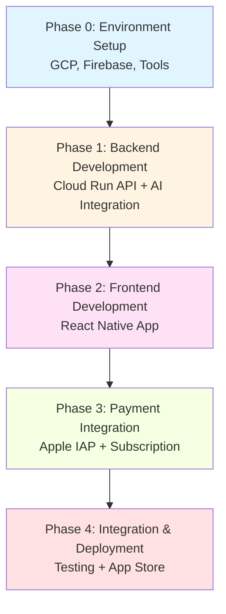
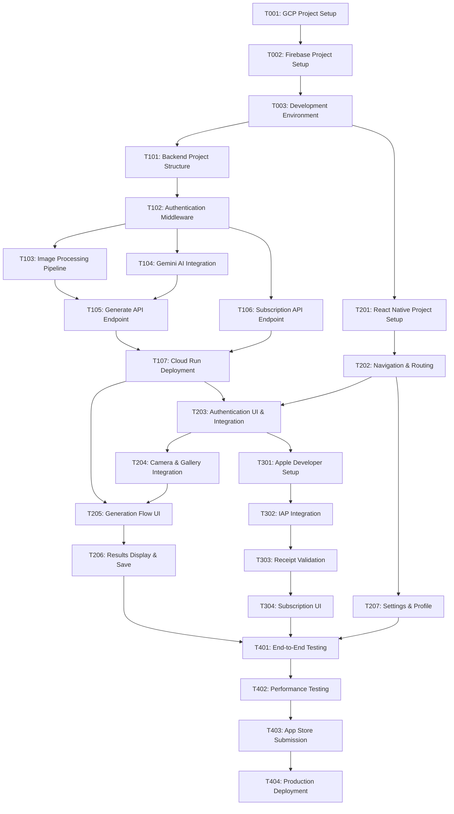

# BananaDish Implementation Work Plan

## Document Information

| Item | Details |
|------|---------|
| Product Name | BananaDish |
| Version | 1.0.0 |
| Created Date | 2026-01-17 |
| Status | Draft |
| Author | Technical Architecture Team |
| Related Documents | [PRD](/docs/prd/bananadish-prd.md), [Design Doc](/docs/design/bananadish-design.md), [App Idea](/docs/ideas/appidea.md) |

---

## Executive Summary

This work plan outlines the implementation strategy for BananaDish, an AI-powered food photography enhancement application for iOS. The plan is structured in 5 phases (Phase 0-4) covering environment setup, backend development, frontend development, payment integration, and final deployment.

### Key Considerations

- **Developer Experience**: React Native/Node.js beginners
- **No Designer**: Use frontend-design skill for UI
- **Budget Constraint**: Minimize infrastructure costs (target < ¥50,000/month for 500 users)
- **Security Priority**: Gemini API key MUST NEVER be in client app
- **Quality Focus**: Built-in testing and quality checks in each phase

### Implementation Strategy

**Strategy B: Implementation-First Development** (no test design information provided)

We will prioritize implementation with quality assurance integrated into each phase, building tests progressively as we implement features.

---

## Phase Structure Diagram



---

## Task Dependency Diagram



---

## Technical Prerequisites

### Required Accounts & Access

- [ ] **Google Cloud Platform (GCP) Account**
  - Billing enabled
  - Project quota: 1 Cloud Run service, Secret Manager enabled
  - Budget alert set to ¥50,000/month

- [ ] **Firebase Account**
  - Firebase project created (can be linked to GCP project)
  - Authentication enabled (Email, Google, Apple)
  - Firestore database created
  - Analytics & Crashlytics enabled

- [ ] **Gemini API Access**
  - API key for Gemini 2.0 Flash Exp model
  - Quota: Sufficient for development + testing (~500 generations/month minimum)

- [ ] **Apple Developer Account**
  - Active membership (¥12,800/year)
  - App Store Connect access
  - Certificates and provisioning profiles
  - IAP products configured

### Development Tools

- [ ] **Node.js**: Version 20 LTS or higher
- [ ] **npm or yarn**: Package manager
- [ ] **Expo CLI**: `npm install -g expo-cli`
- [ ] **gcloud CLI**: For Cloud Run deployment
- [ ] **Firebase CLI**: `npm install -g firebase-tools`
- [ ] **Xcode**: Latest version for iOS development (macOS required)
- [ ] **Git**: Version control
- [ ] **Code Editor**: VS Code recommended with React Native extensions

### Local Environment Verification

Run these commands to verify setup:

```bash
node --version        # Should be v20.x or higher
npm --version         # Should be v10.x or higher
expo --version        # Should be latest
gcloud --version      # Should be latest
firebase --version    # Should be latest
xcode-select -p       # Should show Xcode path
```

---

## Phase 0: Environment Setup

**Objective**: Prepare all cloud infrastructure, development tools, and project foundations.

**Duration Estimate**: 1-2 days

**Prerequisites**: All accounts created, billing enabled

### Tasks

#### T001: GCP Project Setup
- **Description**: Create and configure Google Cloud Platform project for BananaDish
- **Dependencies**: None
- **Deliverables**:
  - [ ] GCP project created (e.g., `bananadish-prod`)
  - [ ] Billing account linked
  - [ ] Required APIs enabled:
    - Cloud Run API
    - Secret Manager API
    - Cloud Build API
    - Cloud Logging API
  - [ ] Budget alerts configured (¥50,000/month threshold)
  - [ ] Service account created for Cloud Run with appropriate permissions
- **Completion Criteria**:
  - All APIs accessible via `gcloud` CLI
  - Service account can access Secret Manager
  - Budget alerts sending to email
- **Verification**:
  ```bash
  gcloud projects describe bananadish-prod
  gcloud services list --enabled
  ```

#### T002: Firebase Project Setup
- **Description**: Initialize Firebase project and link to GCP
- **Dependencies**: T001
- **Deliverables**:
  - [ ] Firebase project created (linked to GCP project)
  - [ ] Authentication configured:
    - Email/Password provider enabled
    - Google Sign-In configured
    - Apple Sign-In configured (with Service ID, Team ID, Key ID)
  - [ ] Firestore database created (production mode)
  - [ ] Firestore security rules deployed (from Design Doc)
  - [ ] Firebase Analytics enabled
  - [ ] Firebase Crashlytics enabled
  - [ ] Firebase Admin SDK service account key downloaded
- **Completion Criteria**:
  - Firebase console accessible
  - Test user can sign in with email/password
  - Firestore security rules active
  - Analytics receiving events
- **Verification**:
  - Test authentication with Firebase console test user
  - Verify Firestore rules using Rules Playground

#### T003: Development Environment Configuration
- **Description**: Set up local development environment and secret management
- **Dependencies**: T001, T002
- **Deliverables**:
  - [ ] Gemini API key obtained and tested
  - [ ] Gemini API key stored in Secret Manager (`GEMINI_API_KEY`)
  - [ ] Apple Shared Secret obtained from App Store Connect
  - [ ] Apple Shared Secret stored in Secret Manager (`APPLE_SHARED_SECRET`)
  - [ ] Firebase service account JSON stored in Secret Manager (`FIREBASE_SERVICE_ACCOUNT`)
  - [ ] Backend `.env` file template created with all required variables (see Appendix B in Design Doc)
  - [ ] Frontend `.env` file template created with EXPO_PUBLIC_* variables
  - [ ] `.gitignore` configured to exclude `.env` files
  - [ ] Git repository initialized with `.gitignore` (exclude secrets)
  - [ ] Development machine has all required tools installed
  - [ ] CORS_ORIGIN environment variable configured for Cloud Run
  - [ ] RATE_LIMIT_PER_MINUTE configured (default: 10)
- **Completion Criteria**:
  - Secrets accessible from Cloud Run (test with dummy service)
  - Gemini API test call succeeds
  - Apple Shared Secret stored securely
  - Environment variable templates documented
  - Git repository excludes all sensitive files
  - All environment variables listed in Design Doc Appendix B are accounted for
- **Verification**:
  ```bash
  # Verify Gemini API key
  gcloud secrets versions access latest --secret="GEMINI_API_KEY"
  curl "https://generativelanguage.googleapis.com/v1beta/models?key=YOUR_KEY"

  # Verify Apple Shared Secret
  gcloud secrets versions access latest --secret="APPLE_SHARED_SECRET"

  # Check .env files are ignored
  git status # Should not show .env files

  # Verify all required environment variables are documented
  cat backend/.env.template
  cat frontend/.env.template
  ```

**Phase 0 Acceptance Criteria**:
- [ ] All GCP services operational
- [ ] Firebase authentication working
- [ ] Secrets securely stored and accessible
- [ ] Development environment ready for coding

---

## Phase 1: Backend Development

**Objective**: Build Cloud Run API proxy service with AI integration, authentication, and image processing.

**Duration Estimate**: 5-7 days

**Prerequisites**: Phase 0 completed

### Tasks

#### T101: Backend Project Structure Setup
- **Description**: Initialize Node.js backend project with TypeScript and core dependencies
- **Dependencies**: T003
- **Deliverables**:
  - [ ] Project directory created: `bananadish-backend/`
  - [ ] `package.json` with dependencies:
    - express ^4.19.2
    - @google/generative-ai ^0.21.0
    - sharp ^0.33.5
    - multer ^1.4.5-lts.1
    - firebase-admin ^12.5.0
  - [ ] TypeScript configured (`tsconfig.json`)
  - [ ] ESLint and Prettier configured
  - [ ] Basic Express server skeleton (`src/server.ts`)
  - [ ] Dockerfile for Cloud Run deployment
  - [ ] `.dockerignore` configured
  - [ ] Health check endpoint implemented (`GET /health`)
- **Completion Criteria**:
  - Server runs locally on port 8080
  - Health check returns `200 OK`
  - TypeScript compiles without errors
  - Docker build succeeds
- **Verification**:
  ```bash
  npm run build
  npm start
  curl http://localhost:8080/health  # Should return "ok"
  docker build -t bananadish-backend .
  ```

#### T102: Authentication Middleware Implementation
- **Description**: Implement Firebase ID token verification middleware
- **Dependencies**: T101, T002
- **Deliverables**:
  - [ ] Firebase Admin SDK initialized in `src/firebase.ts`
  - [ ] Authentication middleware (`src/middleware/auth.ts`):
    - Extracts Bearer token from Authorization header
    - Verifies token with Firebase Admin SDK
    - Attaches user info (`uid`, `email`) to request object
    - Returns 401 for invalid/missing tokens
  - [ ] Error handling for token expiry
  - [ ] Unit tests for auth middleware (minimum 70% coverage)
- **Completion Criteria**:
  - Valid token passes through middleware
  - Invalid token returns 401 with proper error message
  - Expired token returns 401
  - Tests pass
- **Verification**:
  ```bash
  npm test -- auth.test.ts
  # Manual test with curl using Firebase ID token
  ```

#### T103: Image Processing Pipeline Implementation
- **Description**: Implement "contain + blurred background" aspect ratio formatting using Sharp
- **Dependencies**: T101
- **Deliverables**:
  - [ ] Image processing module (`src/services/imageProcessor.ts`)
  - [ ] `formatNoCrop()` function implementing Design Doc algorithm:
    - Background layer: cover resize + blur(30)
    - Foreground layer: contain resize (no crop)
    - Composite foreground on background
  - [ ] Support for all aspect ratios: 4:5, 9:16, 16:9, 1:1
  - [ ] Output format: JPEG, quality 88, mozjpeg compression
  - [ ] Parallel processing for 4 images with Promise.all()
  - [ ] Memory optimization (streaming where possible)
  - [ ] Unit tests with sample images
- **Completion Criteria**:
  - All aspect ratios produce correct dimensions
  - No cropping of main subject
  - Blurred background fills letterbox areas naturally
  - Processing 4 images < 5 seconds on dev machine
  - Tests pass with visual verification
- **Verification**:
  - Process test food image through all aspect ratios
  - Verify output dimensions match specification
  - Visual check: no clipping of food item

#### T104: Gemini AI Integration
- **Description**: Integrate Gemini 2.0 Flash Exp API with retry logic
- **Dependencies**: T101, T003
- **Deliverables**:
  - [ ] Gemini client module (`src/services/geminiClient.ts`)
  - [ ] Prompt engineering implementation (from Design Doc):
    - Japanese prompt template
    - Style modifiers (natural, bright, moody)
  - [ ] `generateImages()` function:
    - Accepts image buffer, mime type, style
    - Sends to Gemini 2.0 Flash Exp
    - Extracts image data from response
  - [ ] `generateWithRetry()` function:
    - Implements retry logic if < 4 images returned
    - Max 3 attempts with exponential backoff
    - Throws error if still < 4 after retries
  - [ ] Circuit breaker pattern for Gemini API failures
  - [ ] Cost tracking (log token usage per generation)
  - [ ] Integration tests (with test API key)
- **Completion Criteria**:
  - Successfully generates 4 images from test food photo
  - Retry logic works when < 4 images returned (simulate by modifying response)
  - Circuit breaker opens after 5 consecutive failures
  - Cost tracking logs appear in console
  - Integration tests pass
- **Verification**:
  ```bash
  npm test -- geminiClient.test.ts
  # Manual test: node scripts/testGemini.js
  ```

#### T105: Generate API Endpoint Implementation
- **Description**: Implement POST /v1/generate endpoint with full pipeline
- **Dependencies**: T102, T103, T104
- **Deliverables**:
  - [ ] Route handler (`src/routes/generate.ts`)
  - [ ] Request validation:
    - Image file required (JPEG/PNG, max 10MB, min 640x480px)
    - Aspect ratio enum validation
    - Style enum validation
  - [ ] Full pipeline orchestration:
    1. Verify authentication
    2. Check usage quota (Firestore)
    3. Generate 4 images with Gemini
    4. Apply aspect ratio formatting
    5. Update usage counter
    6. Return formatted images (base64)
  - [ ] Error handling for all failure modes
  - [ ] Response includes usage info (`used`, `limit`, `remaining`)
  - [ ] Rate limiting (10 requests/min per user)
  - [ ] Integration tests covering:
    - Happy path (4 images generated)
    - Quota exceeded scenario
    - Invalid image format
    - Authentication failure
- **Completion Criteria**:
  - API accepts valid image and returns 4 formatted images
  - Response time < 30 seconds (90th percentile)
  - Quota enforcement works correctly
  - All error cases handled gracefully
  - Integration tests pass
- **Verification**:
  ```bash
  # Test with curl
  curl -X POST http://localhost:8080/v1/generate \
    -H "Authorization: Bearer $ID_TOKEN" \
    -F "image=@test_dish.jpg" \
    -F "aspect=4:5"
  ```

#### T106: Subscription API Endpoint Implementation
- **Description**: Implement GET /v1/subscription/status endpoint
- **Dependencies**: T102
- **Deliverables**:
  - [ ] Route handler (`src/routes/subscription.ts`)
  - [ ] Fetch user document from Firestore
  - [ ] Return subscription status:
    - tier, status, limit, used, remaining
    - renewsAt timestamp
    - addOns array
  - [ ] Handle user not found scenario (create default free tier user)
  - [ ] Unit tests for subscription logic
- **Completion Criteria**:
  - Returns correct subscription data for authenticated user
  - Creates new user document if not exists
  - Tests pass
- **Verification**:
  ```bash
  curl http://localhost:8080/v1/subscription/status \
    -H "Authorization: Bearer $ID_TOKEN"
  ```

#### T107: Cloud Run Deployment Configuration
- **Description**: Deploy backend to Cloud Run with CI/CD
- **Dependencies**: T101, T102, T103, T104, T105, T106
- **Deliverables**:
  - [ ] Cloud Build configuration (`cloudbuild.yaml`)
  - [ ] Cloud Run service configuration:
    - Region: asia-northeast1
    - Min instances: 1 (to avoid cold starts)
    - Max instances: 10
    - Memory: 2 GiB
    - CPU: 2
    - Timeout: 60 seconds
    - Concurrency: 10
  - [ ] Environment variables configured:
    - GEMINI_API_KEY from Secret Manager
    - FIREBASE_SERVICE_ACCOUNT from Secret Manager
  - [ ] Service account attached with permissions:
    - Secret Manager Secret Accessor
    - Firestore User
    - Cloud Logging Writer
  - [ ] CORS configuration (allow app domain)
  - [ ] Production deployment successful
  - [ ] Custom domain configured (optional)
- **Completion Criteria**:
  - Service accessible via HTTPS
  - Health check returns 200
  - Test generation request succeeds
  - Logs appear in Cloud Logging
  - Secrets loaded correctly
- **Verification**:
  ```bash
  gcloud run services describe bananadish-api --region asia-northeast1
  curl https://bananadish-api-XXXXXX.run.app/health
  ```

**Phase 1 Acceptance Criteria**:
- [ ] All API endpoints functional and deployed
- [ ] Authentication working with Firebase tokens
- [ ] Image generation producing 4 high-quality images
- [ ] Aspect ratio formatting correct (no cropping)
- [ ] Usage quota tracking operational
- [ ] API response time < 30 seconds (90th percentile)
- [ ] Error handling comprehensive
- [ ] Cloud Run service stable and monitored

---

## Phase 2: Frontend Development

**Objective**: Build React Native iOS application with camera, generation flow, and authentication.

**Duration Estimate**: 7-10 days

**Prerequisites**: Phase 1 completed (backend API available)

### Tasks

#### T201: React Native Project Setup with Expo
- **Description**: Initialize React Native project with Expo and configure for iOS
- **Dependencies**: T003
- **Deliverables**:
  - [ ] Expo project created: `bananadish-app/`
  - [ ] Project configured for iOS (app.json):
    - Bundle identifier: `com.bananadish.app`
    - Display name: "BananaDish"
    - iOS version: 14.0+
    - Permissions: Camera, Photo Library
  - [ ] Core dependencies installed:
    - expo-image-picker
    - expo-media-library
    - expo-router (file-based routing)
    - @react-native-firebase/app
    - @react-native-firebase/auth
    - react-native-iap
  - [ ] TypeScript configured
  - [ ] ESLint + Prettier configured
  - [ ] Project runs on iOS simulator
  - [ ] Folder structure from Design Doc created
- **Completion Criteria**:
  - App launches on iOS simulator
  - No TypeScript errors
  - Hot reload working
- **Verification**:
  ```bash
  cd bananadish-app
  npm start
  # Press 'i' for iOS simulator
  ```

#### T202: Navigation & Routing Implementation
- **Description**: Set up Expo Router with authentication flow and tab navigation
- **Dependencies**: T201
- **Deliverables**:
  - [ ] File-based routing structure (from Design Doc):
    - `app/(auth)/login.tsx`
    - `app/(auth)/signup.tsx`
    - `app/(tabs)/home.tsx`
    - `app/(tabs)/history.tsx`
    - `app/(tabs)/settings.tsx`
    - `app/onboarding.tsx`
  - [ ] Root layout (`app/_layout.tsx`) with auth state check
  - [ ] Tab navigation configured with icons
  - [ ] Onboarding flow (3 screens, swipeable, skip button)
  - [ ] Navigation type safety
- **Completion Criteria**:
  - Navigating between screens works
  - Auth flow redirects correctly
  - Onboarding shows only on first launch
  - Type-safe navigation
- **Verification**:
  - Test navigation flow manually
  - Verify AsyncStorage stores onboarding completion

#### T203: Authentication UI & Firebase Integration
- **Description**: Implement login, signup, and social authentication UI
- **Dependencies**: T202, T002
- **Deliverables**:
  - [ ] Firebase SDK configured (`src/services/auth/firebase.ts`)
  - [ ] AuthContext provider (`src/contexts/AuthContext.tsx`):
    - User state management
    - ID token management (refresh logic)
    - Sign-in methods: email, Google, Apple
    - Sign-out
  - [ ] Login screen (`app/(auth)/login.tsx`):
    - Email/password fields
    - "Sign in with Google" button
    - "Sign in with Apple" button
    - Link to signup screen
    - Error handling UI
  - [ ] Signup screen (`app/(auth)/signup.tsx`):
    - Email/password fields
    - Validation (min 8 chars password)
    - Link to login screen
  - [ ] Google Sign-In configured (OAuth 2.0 Web Client ID)
  - [ ] Apple Sign-In configured (Service ID, Team ID, Key ID)
  - [ ] Session persistence (stay logged in)
  - [ ] useAuth custom hook for consuming auth state
- **Completion Criteria**:
  - Email/password signup and login work
  - Google Sign-In works (test with real account)
  - Apple Sign-In works (test on device)
  - Session persists across app restarts
  - Error messages displayed in Japanese
- **Verification**:
  - Create test account
  - Sign in with Google
  - Sign in with Apple
  - Verify Firebase console shows users

#### T204: Camera & Gallery Integration
- **Description**: Implement photo capture and selection functionality
- **Dependencies**: T202
- **Deliverables**:
  - [ ] Permissions handling:
    - Camera permission request
    - Photo library permission request
    - User-friendly permission denial messages
  - [ ] Custom hook: `useMediaPermissions`
  - [ ] Camera capture button (launches camera)
  - [ ] Gallery selection button (launches photo library)
  - [ ] Image picker configuration (no editing, max quality)
  - [ ] Selected image preview
  - [ ] Image validation (file size check before upload)
- **Completion Criteria**:
  - Camera opens and captures photo
  - Gallery opens and selects photo
  - Permissions requested appropriately
  - Selected image displayed in app
- **Verification**:
  - Test on iOS simulator (gallery only)
  - Test on physical device (camera + gallery)

#### T205: Generation Flow UI Implementation
- **Description**: Implement main generation flow with aspect ratio selection and API integration
- **Dependencies**: T203, T204, T107
- **Deliverables**:
  - [ ] Home screen (`app/(tabs)/home.tsx`):
    - Camera/Gallery buttons
    - Aspect ratio selector component
    - Usage counter display (e.g., "15 / 30 remaining")
    - "Generate" button (disabled if no image)
  - [ ] Aspect ratio selector component (`components/AspectRatioSelector.tsx`):
    - 4 options: 4:5 (default), 9:16, 16:9, 1:1
    - Visual preview of each ratio
    - Selected state indicator
  - [ ] Generation progress component (`components/GenerationProgress.tsx`):
    - Animated loading indicator
    - Progress message
    - Cancel button (optional)
  - [ ] API client module (`src/services/api/generation.ts`):
    - POST /v1/generate implementation
    - Multipart form-data upload
    - ID token attachment
    - Error handling
  - [ ] useGeneration custom hook:
    - Generation state management
    - Error state
    - Retry logic
  - [ ] Network error handling:
    - Offline detection
    - Timeout handling (45 seconds)
    - User-friendly error messages
- **Completion Criteria**:
  - Generation request successfully sends to backend
  - Loading state displayed during generation
  - 4 images received and stored in state
  - Error messages displayed appropriately
  - Quota exceeded shows upgrade prompt
- **Verification**:
  - Select image, choose aspect ratio, generate
  - Verify API request in Network tab
  - Test offline scenario
  - Test quota exceeded scenario

#### T206: Results Display & Camera Roll Save Implementation
- **Description**: Display generated images and save to camera roll
- **Dependencies**: T205
- **Deliverables**:
  - [ ] Results screen/modal:
    - 2x2 grid layout for 4 images
    - Tap to view full-screen preview
    - Pinch-to-zoom on full-screen
  - [ ] ImageGrid component (`components/ImageGrid.tsx`)
  - [ ] "Save All to Camera Roll" button:
    - Requests permission if needed
    - Saves all 4 images in parallel
    - Creates "BananaDish" album
    - Shows success confirmation
  - [ ] Save functionality (`src/services/storage/mediaLibrary.ts`):
    - Convert base64 to file URI (via FileSystem)
    - Create album if not exists
    - Add assets to album
  - [ ] Success message modal (Japanese)
  - [ ] "Generate Again" button (clears state)
  - [ ] Error handling for save failures
- **Completion Criteria**:
  - All 4 images save to camera roll
  - Images appear in "BananaDish" album
  - Success message displayed
  - Can generate again after saving
- **Verification**:
  - Complete full flow: capture → generate → save
  - Check Photos app for BananaDish album
  - Verify 4 images saved

#### T207: Settings & Profile Screen Implementation
- **Description**: Implement settings screen with subscription info and profile management
- **Dependencies**: T203
- **Deliverables**:
  - [ ] Settings screen (`app/(tabs)/settings.tsx`):
    - User profile display (email, display name)
    - Current subscription tier card
    - Usage progress bar
    - Renewal date
    - "Manage Subscription" button (placeholder)
    - "Restore Purchases" button (placeholder)
    - Logout button
    - Privacy Policy link
    - Terms of Service link
  - [ ] SubscriptionCard component (`components/SubscriptionCard.tsx`)
  - [ ] API client for subscription status (`src/services/api/subscription.ts`):
    - GET /v1/subscription/status implementation
  - [ ] useSubscription custom hook:
    - Fetch subscription status on mount
    - Refresh logic
  - [ ] SubscriptionContext provider (`src/contexts/SubscriptionContext.tsx`)
  - [ ] Logout functionality (clears state, navigates to login)
- **Completion Criteria**:
  - Settings screen displays user info
  - Subscription status fetched from API
  - Usage counter accurate
  - Logout works correctly
- **Verification**:
  - Open settings screen
  - Verify subscription status matches backend
  - Test logout and re-login

**Phase 2 Acceptance Criteria**:
- [ ] App launches and authenticates users
- [ ] Camera/gallery integration working
- [ ] Generation flow complete (select → generate → save)
- [ ] 4 images save to camera roll successfully
- [ ] Settings screen shows subscription info
- [ ] All UI in Japanese
- [ ] Error handling comprehensive
- [ ] App runs smoothly on iOS 14+

---

## Phase 3: Payment Integration

**Objective**: Implement Apple In-App Purchase for subscriptions and add-ons.

**Duration Estimate**: 4-6 days

**Prerequisites**: Phase 2 completed, Apple Developer Account active

### Tasks

#### T301: Apple Developer & App Store Connect Setup
- **Description**: Configure IAP products in App Store Connect
- **Dependencies**: None (can parallel with Phase 2)
- **Deliverables**:
  - [ ] App registered in App Store Connect:
    - Bundle ID: `com.bananadish.app`
    - App name: "BananaDish"
    - Primary language: Japanese
  - [ ] IAP products configured:
    - Auto-Renewable Subscription: `com.bananadish.starter.monthly`
      - Name: "Starter プラン"
      - Price: ¥1,980/month
      - Subscription Group: "BananaDish Subscriptions"
    - Consumable: `com.bananadish.addon.10gen`
      - Name: "追加生成 10回"
      - Price: ¥980
  - [ ] Subscription localization (Japanese)
  - [ ] Pricing tier configured
  - [ ] IAP testing accounts created (Sandbox)
  - [ ] App Store screenshots prepared (placeholder for now)
- **Completion Criteria**:
  - IAP products appear in App Store Connect
  - Sandbox tester accounts work
  - Products available for testing
- **Verification**:
  - Check product status in App Store Connect
  - Verify pricing in Japanese yen

#### T302: React Native IAP Integration
- **Description**: Integrate react-native-iap library and implement purchase flow
- **Dependencies**: T301, T207
- **Deliverables**:
  - [ ] `react-native-iap` v14+ installed and configured
  - [ ] IAP service module (`src/services/iap/purchaseManager.ts`):
    - Initialize IAP connection
    - Fetch available products
    - Purchase flow (requestPurchase)
    - Restore purchases
    - Transaction event listeners
  - [ ] Purchase flow UI:
    - Product selection screen
    - Purchase confirmation alert
    - Processing indicator
    - Success/failure messages
  - [ ] Error handling:
    - Purchase canceled by user
    - Payment failed
    - Network errors
  - [ ] Receipt data extraction
  - [ ] Integration with SubscriptionContext
- **Completion Criteria**:
  - Products load successfully
  - Purchase flow completes (sandbox environment)
  - Receipt data captured
  - Error scenarios handled gracefully
- **Verification**:
  - Test purchase with sandbox account
  - Verify receipt data in console logs
  - Test purchase cancellation

#### T303: Backend Receipt Validation Implementation
- **Description**: Implement Apple IAP receipt validation on backend
- **Dependencies**: T302, T107
- **Deliverables**:
  - [ ] POST /v1/subscription/validate-receipt endpoint:
    - Accept receipt data and transaction ID
    - Validate with Apple's verifyReceipt API
    - Parse subscription info (expires_date, product_id)
    - Update Firestore user document:
      - subscription.tier = 'starter'
      - subscription.status = 'active'
      - subscription.renewDate = expires_date
      - subscription.appleReceiptData = receipt
      - usage.monthlyLimit = 30
    - Handle add-on purchases (increment usage.monthlyLimit temporarily)
  - [ ] Webhook for App Store Server Notifications (optional for MVP):
    - Handle subscription renewal
    - Handle subscription expiration
    - Handle refunds
  - [ ] Receipt verification retry logic
  - [ ] Sandbox vs Production environment detection
  - [ ] Unit tests for receipt parsing
- **Completion Criteria**:
  - Valid receipt updates Firestore subscription
  - Subscription status reflects in app
  - Add-on purchase increments usage limit
  - Invalid receipt returns error
  - Tests pass
- **Verification**:
  ```bash
  # Test with sandbox receipt
  curl -X POST https://bananadish-api-XXXXXX.run.app/v1/subscription/validate-receipt \
    -H "Authorization: Bearer $ID_TOKEN" \
    -H "Content-Type: application/json" \
    -d '{"receiptData":"BASE64_RECEIPT","transactionId":"123456"}'
  ```

#### T304: Subscription Management UI Implementation
- **Description**: Complete subscription UI with purchase and restore functionality
- **Dependencies**: T302, T303
- **Deliverables**:
  - [ ] Subscription upgrade flow:
    - "Upgrade to Starter" button
    - Product details display (price, features)
    - Purchase confirmation dialog
    - Success screen with confetti animation
  - [ ] Add-on purchase flow:
    - "Buy 10 More Generations" button
    - Shows current usage
    - Purchase confirmation
    - Immediate usage limit update
  - [ ] Restore purchases flow:
    - "Restore Purchases" button
    - Fetches previous purchases
    - Calls validate-receipt endpoint
    - Updates UI with restored subscription
  - [ ] Subscription status synchronization:
    - Auto-check on app launch
    - Manual refresh button
  - [ ] Quota exceeded modal:
    - Triggered when generation fails due to quota
    - Direct link to purchase add-on or upgrade
  - [ ] All UI text in Japanese
- **Completion Criteria**:
  - User can purchase Starter subscription
  - User can purchase add-on
  - Restore purchases works
  - Subscription status updates in app
  - Usage counter reflects changes immediately
- **Verification**:
  - Purchase subscription (sandbox)
  - Verify Firestore updated
  - Delete app, reinstall, restore purchases
  - Purchase add-on, verify usage limit increased

**Phase 3 Acceptance Criteria**:
- [ ] IAP products configured in App Store Connect
- [ ] Purchase flow working end-to-end (sandbox)
- [ ] Receipt validation on backend functional
- [ ] Firestore subscription data updates correctly
- [ ] Restore purchases works
- [ ] Quota enforcement reflects subscription tier
- [ ] All payment UI in Japanese

---

## Phase 4: Integration & Deployment

**Objective**: End-to-end testing, performance optimization, and App Store submission.

**Duration Estimate**: 5-7 days

**Prerequisites**: Phases 1, 2, 3 completed

### Tasks

#### T401: End-to-End Integration Testing
- **Description**: Comprehensive testing of all user flows
- **Dependencies**: T206, T304
- **Deliverables**:
  - [ ] Test plan document with scenarios:
    - New user onboarding → signup → first generation → save
    - Existing user login → generation → quota check
    - Free tier → quota exceeded → purchase → generation
    - Subscription purchase → renewal check → restore
    - Error scenarios (offline, API failure, etc.)
  - [ ] Test execution on physical devices:
    - iPhone 8 (iOS 14)
    - iPhone 12 (iOS 16)
    - iPhone 15 (iOS 17)
  - [ ] Bug tracking sheet
  - [ ] Critical bugs fixed
  - [ ] Regression testing after fixes
  - [ ] Firebase Analytics events verification:
    - `app_open`
    - `sign_up`
    - `login`
    - `generation_started`
    - `generation_completed`
    - `images_saved`
    - `purchase_initiated`
    - `purchase_completed`
  - [ ] Crashlytics integration verified (force a test crash)
- **Completion Criteria**:
  - All critical user flows work without errors
  - No crashes during normal usage
  - Analytics events appear in Firebase console
  - Bug list reviewed and prioritized
- **Verification**:
  - Execute each test scenario
  - Check Firebase Analytics for events
  - Review Crashlytics for any crashes

#### T402: Performance & Quality Testing
- **Description**: Verify performance targets and quality metrics
- **Dependencies**: T401
- **Deliverables**:
  - [ ] Performance benchmarks:
    - App launch time: < 2 seconds ✓
    - Generation response time: 90th percentile < 30 seconds ✓
    - Image save time: < 3 seconds for 4 images ✓
  - [ ] Memory profiling:
    - No memory leaks during 10 consecutive generations
    - Memory usage < 200 MB during generation
  - [ ] Network profiling:
    - Request payload optimization
    - Response caching where applicable
  - [ ] Image quality verification:
    - All aspect ratios produce correct dimensions
    - No cropping of food item (visual check)
    - Blurred background appears natural
    - Output resolution 1080px on longest side
  - [ ] Accessibility audit:
    - VoiceOver support (basic)
    - Dynamic Type support
    - Color contrast check
  - [ ] Localization check:
    - All UI strings in Japanese
    - No hardcoded English strings
    - Date/time formatting (Japanese locale)
- **Completion Criteria**:
  - All performance targets met
  - No memory leaks detected
  - Image quality verified with 10+ test photos
  - Accessibility checklist completed
  - All text in Japanese
- **Verification**:
  - Use Xcode Instruments for profiling
  - Test with variety of food photos
  - Enable VoiceOver and test navigation

#### T403: App Store Submission Preparation
- **Description**: Prepare all assets and metadata for App Store submission
- **Dependencies**: T402
- **Deliverables**:
  - [ ] App Store metadata (Japanese):
    - App name: "BananaDish"
    - Subtitle: "料理写真を一瞬でプロ級に"
    - Description (compelling copy highlighting value)
    - Keywords for ASO
    - Support URL (landing page)
    - Privacy Policy URL (published)
    - Terms of Service URL (published)
  - [ ] Screenshots (using frontend-design skill):
    - iPhone 6.7" display (1 set)
    - iPhone 6.5" display (1 set)
    - iPhone 5.5" display (1 set)
    - Minimum 3 screenshots per size
    - Showcase: capture, generation, results, save
  - [ ] App icon (1024x1024px):
    - Food photography themed
    - Professional appearance
    - Meets Apple guidelines
  - [ ] Privacy details configured:
    - Data collection disclosure
    - User identification data usage
    - Contact info, email addresses
  - [ ] Age rating: 4+
  - [ ] App review notes:
    - Test account credentials
    - Feature explanation for reviewers
  - [ ] Build configuration:
    - Version: 1.0.0
    - Build number: 1
    - Release build optimized
    - Debugging disabled
  - [ ] Archive and upload to App Store Connect
- **Completion Criteria**:
  - All metadata completed in App Store Connect
  - Screenshots uploaded
  - App icon uploaded
  - Privacy policy live and accessible
  - Build uploaded successfully
  - "Ready for Review" status
- **Verification**:
  - Preview listing in App Store Connect
  - Verify all required fields completed
  - Test links (privacy policy, support URL)

#### T404: Production Deployment & Launch
- **Description**: Final production deployment and App Store submission
- **Dependencies**: T403, T107
- **Deliverables**:
  - [ ] Backend production environment verified:
    - Cloud Run service healthy
    - Secrets configured correctly
    - Firestore production database ready
    - Firebase Authentication live
  - [ ] Backend monitoring configured:
    - Cloud Logging alerts for errors
    - Uptime monitoring (Cloud Monitoring)
    - Budget alerts active
    - Gemini API quota alerts
  - [ ] App Store submission:
    - Submit for review
    - Monitor review status
    - Respond to reviewer questions if any
  - [ ] App Store approval received
  - [ ] Release strategy:
    - Phased release (recommended)
    - Release notes (Japanese)
  - [ ] Post-launch monitoring:
    - Firebase Analytics dashboard
    - Crashlytics dashboard
    - Cloud Logging dashboard
    - Real user feedback tracking
  - [ ] Support email configured: support@bananadish.app
  - [ ] Beta user outreach (10+ restaurant owners)
- **Completion Criteria**:
  - App approved and live on App Store
  - Backend stable under initial load
  - Monitoring dashboards functional
  - Support email receiving messages
  - Beta users onboarded
- **Verification**:
  - Download app from App Store
  - Complete full user flow on production
  - Verify analytics data flowing
  - Test support email

**Phase 4 Acceptance Criteria**:
- [ ] All user flows tested and working
- [ ] Performance targets met
- [ ] App Store submission complete
- [ ] App approved and live
- [ ] Monitoring active
- [ ] Support infrastructure ready
- [ ] Beta users testing successfully

---

## Risk Assessment & Mitigation

### Critical Technical Risks

| Risk | Probability | Impact | Mitigation Strategy | Owner |
|------|------------|--------|---------------------|-------|
| **Gemini API generates < 4 images** | Medium | High | Implement robust retry logic (up to 3 attempts); fallback to 3 images with user warning if persistent | Backend Dev |
| **AI hallucinates food elements** | Medium | High | Careful prompt engineering emphasizing authenticity; user feedback loop; manual review of test generations | Backend Dev |
| **Cloud Run cold start latency** | High | Medium | Set min instances to 1; optimize Docker image size (< 500 MB); use multi-stage builds | DevOps |
| **API cost exceeds budget** | Medium | Critical | Strict rate limiting (10/min/user); usage quotas enforced; GCP budget alerts at ¥40,000; cost monitoring dashboard | Backend Dev |
| **Apple App Review rejection** | Low | High | Pre-submission checklist; privacy policy clear; follow HIG; test with sandbox thoroughly; conservative content policies | iOS Dev |
| **Token leakage/security breach** | Low | Critical | Never embed API keys in app; all secrets in Secret Manager; regular security audits; HTTPS only | Security Lead |

### Business & Operational Risks

| Risk | Probability | Impact | Mitigation Strategy | Owner |
|------|------------|--------|---------------------|-------|
| **Low user adoption (< 100 in 3 months)** | Medium | High | Pre-launch outreach to restaurant associations; beta program with 10+ users; referral incentives | Product Lead |
| **High churn rate (> 60%)** | Medium | High | Onboarding optimization; quality monitoring; in-app feedback surveys; usage analytics review | Product Lead |
| **Overwhelming support requests** | Medium | Medium | Comprehensive FAQ; in-app tutorials; automated responses; clear error messages | Support Lead |
| **Subscription bugs (double charging)** | Low | Critical | Extensive IAP testing; sandbox validation; receipt verification; manual check for early users | iOS Dev |
| **Gemini API service disruption** | Low | High | Circuit breaker pattern; status page; proactive user communication; graceful degradation | Backend Dev |

### Developer Experience Risks

| Risk | Probability | Impact | Mitigation Strategy | Owner |
|------|------------|--------|---------------------|-------|
| **React Native inexperience causes delays** | High | Medium | Follow Design Doc closely; use Expo managed workflow; leverage community examples; pair programming | Tech Lead |
| **Node.js inexperience causes bugs** | Medium | Medium | Use TypeScript for safety; comprehensive testing; code reviews; follow established patterns | Tech Lead |
| **No designer = poor UI** | High | Medium | Use frontend-design skill; follow iOS HIG; reference competitor apps; user testing feedback | Product Lead |
| **Underestimated complexity** | Medium | High | Build MVP scope only; timebox each phase; weekly progress reviews; cut features if needed | Project Manager |

### Risk Monitoring Plan

**Weekly Risk Review**:
- [ ] Review budget vs. actual costs
- [ ] Check API error rates and success rates
- [ ] Monitor user feedback (beta users)
- [ ] Track phase completion vs. estimates
- [ ] Adjust mitigation strategies as needed

---

## Quality Assurance Checklist

### Pre-Launch Quality Gates

#### Security Checklist
- [ ] Gemini API key NOT in client app code
- [ ] All secrets in GCP Secret Manager
- [ ] HTTPS enforced on all endpoints
- [ ] Firebase token validation working
- [ ] Apple IAP receipt validation implemented
- [ ] Firestore security rules deployed and tested
- [ ] No sensitive data logged to console (production)
- [ ] User data encryption at rest (Firestore default)

#### Functionality Checklist
- [ ] Photo capture works on all iOS versions (14+)
- [ ] Photo library selection works
- [ ] 95%+ generation success rate (4 images)
- [ ] Aspect ratio formatting produces no-crop results
- [ ] Blurred background appears natural
- [ ] All 4 images save to camera roll correctly
- [ ] Email/password auth works
- [ ] Google Sign-In works
- [ ] Apple Sign-In works
- [ ] Subscription purchase completes end-to-end
- [ ] Usage quota enforcement correct
- [ ] Quota exceeded triggers upgrade prompt
- [ ] Restore purchases works
- [ ] Add-on purchase increments limit

#### Performance Checklist
- [ ] App launch time < 2 seconds
- [ ] 90% of generations complete in < 30 seconds
- [ ] Image save time < 3 seconds for 4 images
- [ ] No memory leaks during 10 consecutive generations
- [ ] Crash rate < 0.5% (monitored in Crashlytics)
- [ ] Backend uptime 99.5%+ (monitored in Cloud Monitoring)

#### UX/UI Checklist
- [ ] All UI text in Japanese
- [ ] No hardcoded English strings
- [ ] Error messages user-friendly and actionable
- [ ] Loading states provide feedback
- [ ] Success confirmations clear
- [ ] Onboarding completable in < 2 minutes
- [ ] No more than 3 taps for primary flow
- [ ] VoiceOver support (basic navigation)
- [ ] Dynamic Type support
- [ ] Color contrast WCAG AA compliant

#### Legal & Compliance Checklist
- [ ] Privacy Policy published (Japanese)
- [ ] Terms of Service published (Japanese)
- [ ] App Store metadata complete (Japanese)
- [ ] Age rating appropriate (4+)
- [ ] Apple Human Interface Guidelines compliance
- [ ] APPI (Japan privacy law) compliance
- [ ] Data collection disclosure accurate
- [ ] No sharing of user data with third parties

#### Business Checklist
- [ ] Pricing finalized (¥1,980/month, ¥980 add-on)
- [ ] Pricing configured in App Store Connect
- [ ] Customer support email active (support@bananadish.app)
- [ ] Beta testing with 10+ restaurant owners completed
- [ ] Positive beta feedback (NPS > 40)
- [ ] Landing page live (support URL)
- [ ] Social media presence (optional for MVP)

---

## Operational Verification Procedures

### Phase 1 Backend Verification

**After T107 (Cloud Run Deployment)**:

1. **Health Check**:
   ```bash
   curl https://bananadish-api-XXXXXX.run.app/health
   # Expected: 200 OK with "ok" body
   ```

2. **Authentication Test**:
   ```bash
   # Get Firebase ID token (from Firebase console test user)
   TOKEN="eyJhbGciOiJSUzI1NiIsImtpZCI..."

   curl https://bananadish-api-XXXXXX.run.app/v1/subscription/status \
     -H "Authorization: Bearer $TOKEN"
   # Expected: 200 OK with subscription JSON
   ```

3. **Generation Test**:
   ```bash
   curl -X POST https://bananadish-api-XXXXXX.run.app/v1/generate \
     -H "Authorization: Bearer $TOKEN" \
     -F "image=@test_ramen.jpg" \
     -F "aspect=4:5" \
     -F "style=natural"
   # Expected: 200 OK with 4 base64 images
   # Verify response time < 30 seconds
   ```

4. **Error Handling Test**:
   ```bash
   # Test quota exceeded (manually set usage to limit in Firestore first)
   curl -X POST https://bananadish-api-XXXXXX.run.app/v1/generate \
     -H "Authorization: Bearer $TOKEN" \
     -F "image=@test.jpg"
   # Expected: 402 QUOTA_EXCEEDED
   ```

5. **Cloud Logging Verification**:
   ```bash
   gcloud logging read "resource.type=cloud_run_revision" --limit 50
   # Verify no ERROR level logs (except intentional tests)
   ```

### Phase 2 Frontend Verification

**After T206 (Save Implementation)**:

1. **Full User Flow Test (iOS Simulator)**:
   - Launch app
   - Sign up with test email
   - Complete onboarding
   - Select photo from gallery
   - Choose aspect ratio 4:5
   - Tap "Generate"
   - Wait for 4 images (verify progress indicator)
   - Tap "Save All"
   - Check Photos app for BananaDish album
   - Verify 4 images saved correctly

2. **Authentication Flow Test**:
   - Sign out
   - Sign in with same account (verify session)
   - Sign in with Google (test on device)
   - Sign in with Apple (test on device)

3. **Error Scenario Tests**:
   - Enable Airplane Mode → try generation → verify error message
   - Select invalid file → verify validation error
   - Exceed quota → verify upgrade prompt

4. **Analytics Verification**:
   - Firebase Console → Analytics → Events
   - Verify events: `app_open`, `sign_up`, `generation_started`, `generation_completed`, `images_saved`

### Phase 3 Payment Verification

**After T304 (Subscription UI)**:

1. **Sandbox Purchase Test**:
   - Sign in with sandbox Apple ID
   - Tap "Upgrade to Starter"
   - Complete purchase
   - Verify confirmation screen
   - Check Firestore user document:
     ```javascript
     subscription.tier === 'starter'
     subscription.status === 'active'
     usage.monthlyLimit === 30
     ```

2. **Add-On Purchase Test**:
   - Purchase 10 generation add-on
   - Verify usage limit increased temporarily
   - Check Firestore: `usage.monthlyLimit` should be current + 10

3. **Restore Purchases Test**:
   - Delete app
   - Reinstall
   - Sign in
   - Tap "Restore Purchases"
   - Verify subscription restored

4. **Receipt Validation Test**:
   - Check backend logs for receipt validation
   - Verify no errors in Cloud Logging

### Phase 4 Production Verification

**After T404 (Production Deployment)**:

1. **App Store Download Test**:
   - Download from App Store
   - Complete full user flow
   - Verify production backend called (check Cloud Logging)

2. **Real Purchase Test**:
   - Use real Apple ID (not sandbox)
   - Purchase Starter subscription
   - Verify charge appears in Apple account
   - Verify Firestore production database updated

3. **Monitoring Dashboard Check**:
   - Firebase Analytics: Verify real user events
   - Firebase Crashlytics: Check for crashes
   - Cloud Logging: Monitor error rates
   - Cloud Monitoring: Check uptime

4. **Performance Monitoring**:
   - Cloud Run metrics: Response time, error rate
   - Firebase Performance: App start time, network requests

---

## Success Metrics & KPIs

### Launch Readiness Metrics (Go/No-Go Criteria)

**Must meet ALL before App Store submission**:

- [ ] **Functionality**: 95%+ generation success rate (4 images)
- [ ] **Performance**: 90% of generations < 30 seconds
- [ ] **Stability**: App crash rate < 0.5% in beta testing
- [ ] **Security**: Gemini API key not in app, token validation working
- [ ] **Legal**: Privacy policy live, terms of service live
- [ ] **Business**: 10+ beta testers completed test, NPS > 40

### Post-Launch Success Metrics (3 Months)

**Acquisition**:
- Target: 500 total downloads
- Target: 300 active registrations
- Measurement: App Store Connect Analytics

**Activation**:
- Target: 70% completion of first generation
- Target: 50% save at least one result
- Measurement: Firebase Analytics funnels

**Retention**:
- Target: 40% Day 30 retention
- Target: 60% Week 1 retention
- Measurement: Firebase Analytics cohort analysis

**Revenue**:
- Target: 15% conversion to paid subscription
- Target: 45 paying subscribers
- Target: ¥89,100 MRR (Monthly Recurring Revenue)
- Measurement: App Store sales reports + Firestore

**Engagement**:
- Target: 20 generations per active user/month
- Target: 85% photo save rate
- Target: 3 sessions per user/week
- Measurement: Firebase Analytics custom events

**Quality**:
- Target: NPS > 50
- Target: 4.5+ stars on App Store
- Target: < 1% reported quality issues
- Measurement: In-app survey + App Store reviews

---

## Appendix A: Development Environment Setup Guide

### macOS Development Setup (Complete Guide for Beginners)

#### Step 1: Install Homebrew
```bash
/bin/bash -c "$(curl -fsSL https://raw.githubusercontent.com/Homebrew/install/HEAD/install.sh)"
```

#### Step 2: Install Node.js
```bash
brew install node@20
node --version  # Verify v20.x
```

#### Step 3: Install Git
```bash
brew install git
git --version
```

#### Step 4: Install Xcode
1. Open App Store
2. Search "Xcode"
3. Install (large download, ~10 GB)
4. Open Xcode, accept license
5. Run: `sudo xcode-select --install`

#### Step 5: Install Expo CLI
```bash
npm install -g expo-cli
expo --version
```

#### Step 6: Install gcloud CLI
```bash
brew install google-cloud-sdk
gcloud init  # Follow login prompts
```

#### Step 7: Install Firebase CLI
```bash
npm install -g firebase-tools
firebase login
```

#### Step 8: Install VS Code (Recommended Editor)
```bash
brew install --cask visual-studio-code
```

**Recommended VS Code Extensions**:
- ESLint
- Prettier
- React Native Tools
- TypeScript + JavaScript
- Firebase

#### Step 9: Set Up iOS Simulator
```bash
# List available simulators
xcrun simctl list devices

# Boot a simulator (example: iPhone 15)
open -a Simulator
```

---

## Appendix B: Troubleshooting Guide

### Common Issues & Solutions

#### Issue: "Cannot connect to Cloud Run service"
**Symptoms**: API requests fail with network error
**Solutions**:
1. Check Cloud Run URL is correct
2. Verify service is deployed: `gcloud run services list`
3. Check CORS configuration allows app domain
4. Test with curl to isolate client vs server issue

#### Issue: "Firebase token verification failed"
**Symptoms**: 401 UNAUTHORIZED errors
**Solutions**:
1. Verify Firebase project ID matches in app and backend
2. Check token not expired (refresh token)
3. Verify Firebase Admin SDK initialized correctly
4. Check service account has correct permissions

#### Issue: "Images not saving to camera roll"
**Symptoms**: Save succeeds but photos don't appear
**Solutions**:
1. Check permission granted in Settings → BananaDish → Photos
2. Verify album creation logic (check logs)
3. Try converting base64 to file first (use FileSystem)
4. Test on physical device (simulator can have different behavior)

#### Issue: "Gemini API returns < 4 images"
**Symptoms**: Generation fails with AI_GENERATION_FAILED
**Solutions**:
1. Check prompt is not too restrictive
2. Verify input image quality (not corrupted)
3. Test with different food photos
4. Review retry logic logs
5. Check Gemini API quota not exceeded

#### Issue: "App crashes on launch"
**Symptoms**: White screen or crash immediately
**Solutions**:
1. Check Crashlytics for error details
2. Verify all native modules linked correctly
3. Clean build: `cd ios && pod install && cd ..`
4. Reset metro bundler cache: `expo start -c`
5. Check for missing environment variables

#### Issue: "IAP purchase fails in sandbox"
**Symptoms**: "Cannot connect to iTunes Store"
**Solutions**:
1. Sign out of production Apple ID in Settings
2. Use sandbox tester account (created in App Store Connect)
3. Verify IAP products have "Ready to Submit" status
4. Check bundle ID matches exactly
5. Test on physical device (sandbox unreliable on simulator)

---

## Appendix C: Cost Estimation

### Monthly Infrastructure Costs (500 MAU Scenario)

| Service | Usage | Cost (¥) | Notes |
|---------|-------|----------|-------|
| **Cloud Run** | 15,000 requests, 2 vCPU, 2 GiB RAM | ¥8,000 | Assuming 30 generations/user/month |
| **Gemini API** | 15,000 generations × 4 images | ¥30,000 | ~¥2 per image (estimated) |
| **Firestore** | 30,000 reads, 15,000 writes | ¥500 | Minimal document size |
| **Cloud Storage** | 0 GB (using base64) | ¥0 | Future: ¥500 with signed URLs |
| **Secret Manager** | 2 secrets, 30,000 accesses | ¥200 | Gemini key + Firebase SA |
| **Firebase** | Authentication, Analytics, Crashlytics | ¥0 | Free tier sufficient |
| **Cloud Logging** | 10 GB logs | ¥300 | Standard logging |
| **Cloud Monitoring** | Basic metrics | ¥0 | Free tier |
| **Apple Developer** | Annual fee | ¥1,067/month | ¥12,800/year |
| **Total** | | **¥40,067** | Within ¥50,000 target |

**Revenue (500 MAU, 15% conversion)**:
- 75 paying users × ¥1,980 = ¥148,500/month
- Gross margin: ¥148,500 - ¥40,067 = **¥108,433** (73%)

---

## Document Change History

| Version | Date | Author | Changes |
|---------|------|--------|---------|
| 1.0.0 | 2026-01-17 | Technical Architecture Team | Initial work plan creation |

---

**Document Status**: Draft - Ready for development team review and kickoff

**Next Actions**:
1. Review work plan with development team
2. Confirm resource allocation and timeline
3. Begin Phase 0: Environment Setup
4. Set up weekly progress reviews
5. Kickoff development

---

## Quality Checklist (Work Plan Creation)

- [x] Design Doc consistency verified
- [x] Phase composition based on technical dependencies
- [x] All PRD requirements converted to tasks
- [x] Quality assurance exists in final phase
- [x] Operational verification procedures placed at integration points
- [x] Test design information: N/A (Strategy B: Implementation-First)
- [x] Task dependencies clearly defined (max 2 levels)
- [x] Each task has explicit completion criteria
- [x] Diagrams created (Phase Structure, Task Dependencies)
- [x] Risk assessment comprehensive
- [x] Cost estimation included
- [x] Success metrics defined
