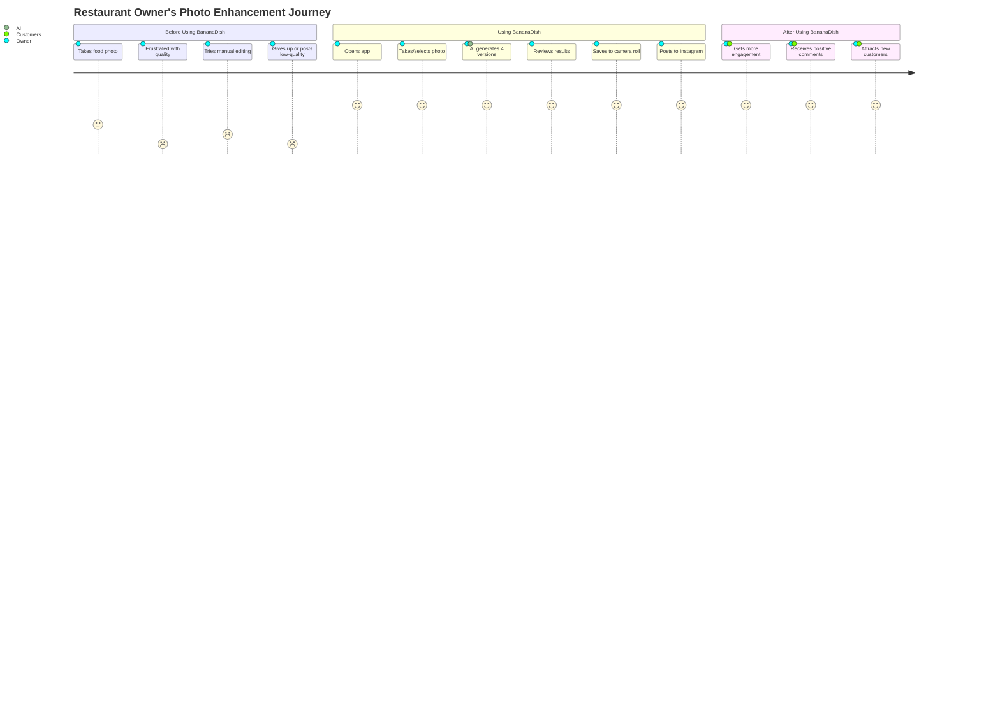
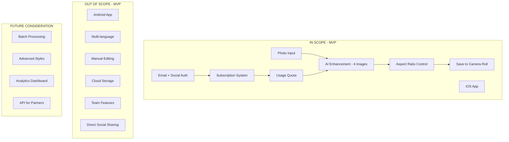
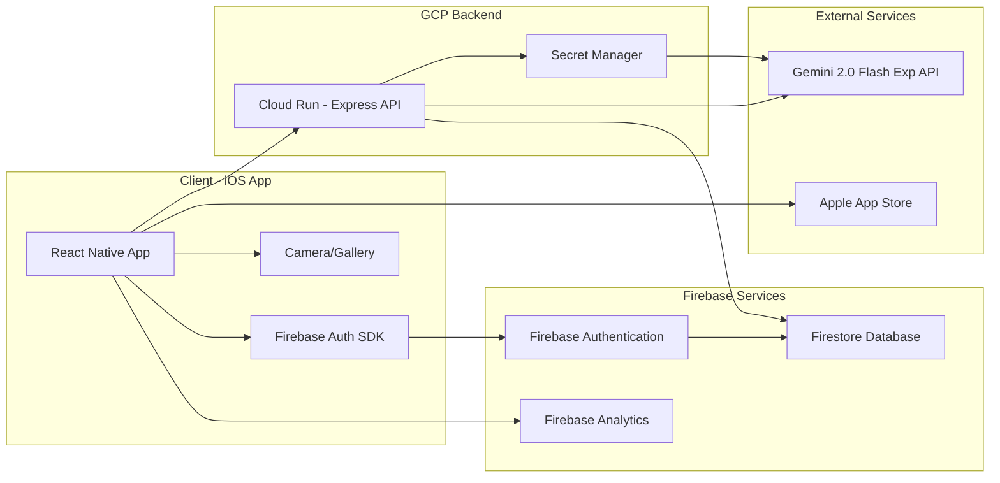
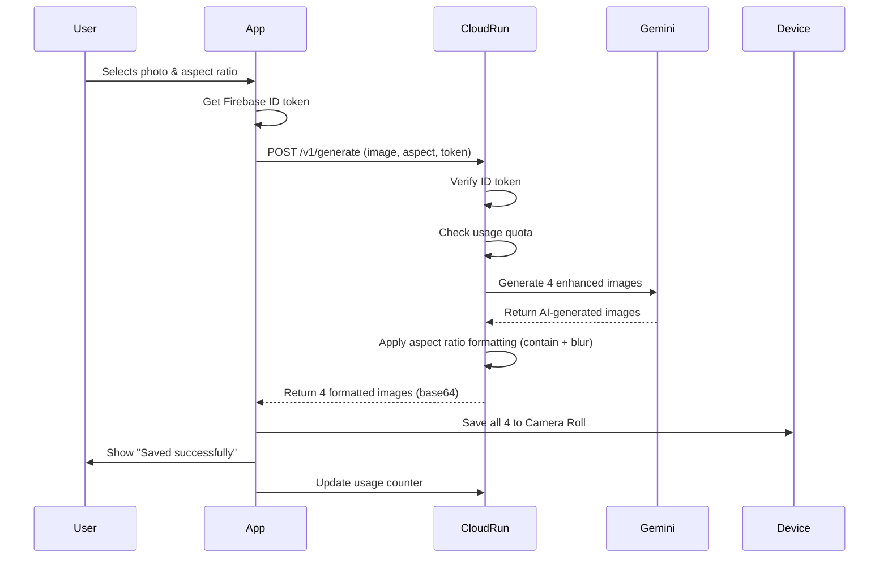

# Product Requirements Document: BananaDish

## Document Information

| Item | Details |
|------|---------|
| Product Name | BananaDish |
| Version | 1.0.0 |
| Created Date | 2026-01-17 |
| Status | Draft |
| Author | Product Team |
| Target Launch | Q1 2026 (ASAP) |

---

## Executive Summary

BananaDish is an AI-powered mobile application designed to help restaurant owners transform their food photography into professional, social media-ready images in seconds. By leveraging Gemini 2.0 Flash Exp AI technology, the app generates 4 variations of enhanced food photos from a single snapshot, eliminating the need for expensive photographers or time-consuming photo editing skills.

### Problem Statement

Restaurant owners face significant challenges in creating high-quality food photography for social media marketing:
- Professional food photography costs $500-2,000 per session
- 74% of diners use social media to decide where to eat
- Restaurants with professional photos receive 24-35% more orders
- Most restaurant owners lack photo editing skills or tools
- Time-consuming manual editing takes away from core business operations

### Solution

BananaDish provides an instant, affordable solution that generates 4 professionally-enhanced food photos from a single photograph, optimized for social media platforms with proper aspect ratios and visual appeal.

### Success Metrics (KPIs)

| Metric | Target (3 months post-launch) | Measurement Method |
|--------|-------------------------------|-------------------|
| Monthly Active Users (MAU) | 500+ restaurant owners | Firebase Analytics |
| Conversion Rate (Free → Paid) | 15% | Subscription analytics |
| User Retention (Day 30) | 40% | Cohort analysis |
| Average Generation per User | 20 per month | Usage tracking |
| User Satisfaction (NPS) | 50+ | In-app survey |
| Photo Save Rate | 85%+ | Action tracking |

---

## Market Context & Business Value

### Market Opportunity (2026)

Based on current market research:
- **Social Media Dominance**: 74% of consumers use social media to decide dining locations
- **Instagram Critical**: 90% of restaurants rate Instagram as very/extremely important
- **AI Adoption**: 2026 is positioned as "the year of AI-driven restaurants"
- **Cost Efficiency**: AI photo enhancement costs 95% less than traditional photography
- **Engagement Impact**: AI-driven personalization increases engagement by up to 80%

### Target Market

**Primary**: Independent restaurant owners (1-3 locations) in Japan
- Actively manage social media presence
- Limited marketing budget
- Need quick, frequent content updates
- Tech-comfortable (uses smartphone for business)

**Secondary**: Small restaurant chains (4-10 locations)
- Standardizing social media content across locations
- Seeking cost-efficient photography solutions

### Competitive Advantage

1. **Specialized Focus**: Purpose-built for food photography (not general photo editing)
2. **Speed**: 4 professional photos in under 30 seconds
3. **Simplicity**: Single-tap operation, no editing knowledge required
4. **Quality**: AI maintains dish authenticity while enhancing visual appeal
5. **Cost**: 95% cheaper than professional photography
6. **Aspect Ratio Intelligence**: Auto-formats for Instagram/social platforms

---

## User Personas

### Persona 1: Takeshi (Primary User)
**Role**: Owner-chef of independent izakaya in Tokyo

**Demographics**:
- Age: 42
- Tech Skill: Intermediate
- Social Media: Active on Instagram (posts 3-4x/week)

**Goals**:
- Attract more customers through Instagram
- Create professional-looking posts without hiring photographers
- Save time on photo editing

**Pain Points**:
- Photos taken on smartphone look amateur
- Can't afford professional photographer regularly
- Tried photo editing apps but too complex/time-consuming
- Inconsistent lighting in restaurant makes photos look bad

**Usage Pattern**:
- Takes photos of daily specials
- Posts during slow afternoon hours
- Needs 15-20 photos per month

### Persona 2: Yuki (Secondary User)
**Role**: Social media manager for small restaurant chain (5 locations)

**Demographics**:
- Age: 28
- Tech Skill: Advanced
- Social Media: Manages multiple accounts

**Goals**:
- Maintain consistent brand image across locations
- Quick turnaround for seasonal menu promotions
- Scale content production without increasing budget

**Pain Points**:
- Each location has different lighting conditions
- Inconsistent photo quality across locations
- Budget constraints limit professional photography
- Need high volume of content for multiple platforms

**Usage Pattern**:
- Processes batches of photos from different locations
- Needs 80-100 photos per month
- Requires multiple aspect ratios for different platforms

---

## User Journey



### Critical User Flows

#### Primary Flow: Single Photo Enhancement
1. **Launch App** → User opens BananaDish
2. **Capture/Select** → Takes new photo or selects from camera roll
3. **AI Processing** → Displays progress (10-30 seconds)
4. **Review Results** → Views 4 enhanced variations in grid
5. **Save All** → Taps "Save All" button
6. **Confirmation** → Receives "Saved to Camera Roll" message
7. **Exit** → Returns to home or continues with new photo

#### Secondary Flow: Aspect Ratio Selection
1. **Settings Access** → User taps aspect ratio selector before generation
2. **Choose Format** → Selects from 4:5, 9:16, 16:9, 1:1
3. **Generate** → Proceeds with primary flow
4. **Consistent Output** → All 4 images use selected aspect ratio

#### Error Flow: Insufficient Generations Remaining
1. **Attempt Generation** → User exceeds monthly quota
2. **Limit Alert** → "Monthly limit reached (30/30 used)"
3. **Upgrade Prompt** → Option to purchase add-on (10 generations for ¥980)
4. **Purchase/Cancel** → User decides next action

---

## Functional Requirements (MVP)

### MoSCoW Prioritization

#### MUST Have (MVP Core)

**FR-001: Photo Input**
- **Description**: User can capture new photo or select from camera roll
- **Acceptance Criteria**:
  - Camera integration works on iOS devices
  - Photo library access with user permission
  - Supports JPEG and PNG formats
  - File size limit: 10MB
  - Minimum resolution: 640x480px
- **Priority**: P0 (Blocker)

**FR-002: AI Enhancement Generation**
- **Description**: Generate 4 enhanced variations of input photo using Gemini 2.0 Flash Exp
- **Acceptance Criteria**:
  - Consistently produces exactly 4 images
  - Maintains dish authenticity (no hallucinated elements)
  - Enhances lighting, texture, and visual appeal
  - Processing time: 10-30 seconds
  - Handles errors gracefully (retry logic for <4 images)
- **Priority**: P0 (Blocker)

**FR-003: Aspect Ratio Formatting**
- **Description**: Apply selected aspect ratio with no-crop (contain + blurred background) method
- **Acceptance Criteria**:
  - Supports 4 aspect ratios: 4:5, 9:16, 16:9, 1:1
  - No cropping/clipping of food item
  - Blurred background fills letterbox areas
  - Default ratio: 4:5 (Instagram feed optimized)
  - Output resolution: 1080px on longest side
- **Priority**: P0 (Blocker)

**FR-004: Batch Save to Camera Roll**
- **Description**: Save all 4 generated images to device camera roll with single tap
- **Acceptance Criteria**:
  - "Save All" button saves 4 images simultaneously
  - Creates album "BananaDish" for organization
  - Requests camera roll permission if not granted
  - Shows success confirmation
  - Files named with timestamp for sorting
- **Priority**: P0 (Blocker)

**FR-005: Email + Social Authentication**
- **Description**: User authentication via Firebase Auth supporting email and social login
- **Acceptance Criteria**:
  - Email/password registration and login
  - Google Sign-In integration
  - Apple Sign-In integration (iOS requirement)
  - Password reset via email
  - Session persistence (stay logged in)
- **Priority**: P0 (Blocker)

**FR-006: Usage Quota Management**
- **Description**: Track and enforce monthly generation limits per subscription tier
- **Acceptance Criteria**:
  - Starter plan: 30 generations/month
  - Counter resets on subscription anniversary
  - Display remaining generations in UI
  - Block generation when quota exceeded
  - Clear error message with upgrade option
- **Priority**: P0 (Blocker)

**FR-007: In-App Subscription (iOS)**
- **Description**: Enable subscription purchase via Apple In-App Purchase
- **Acceptance Criteria**:
  - Starter plan: ¥1,980/month, 30 generations
  - Add-on: ¥980 for 10 additional generations
  - Integration with App Store billing
  - Subscription status synced with backend
  - Restore purchases functionality
  - Receipt validation for security
- **Priority**: P0 (Blocker)

#### SHOULD Have (MVP Enhancement)

**FR-008: Generation History**
- **Description**: View past 10 generations with thumbnails
- **Acceptance Criteria**:
  - Shows original and 4 enhanced versions
  - Limited to last 10 sessions
  - Tap to view full size
  - Option to re-save to camera roll
- **Priority**: P1 (Important)

**FR-009: Style Hints (Basic)**
- **Description**: Optional style preference for generation
- **Acceptance Criteria**:
  - 3 options: Natural (default), Bright, Moody
  - Affects AI prompt engineering
  - Can skip selection (uses default)
- **Priority**: P1 (Important)

**FR-010: Onboarding Tutorial**
- **Description**: First-time user walkthrough
- **Acceptance Criteria**:
  - 3-screen swipeable introduction
  - Shows key features: capture, generate, save
  - "Skip" option available
  - Only shows once per installation
- **Priority**: P1 (Important)

#### COULD Have (Post-MVP)

**FR-011: Individual Image Selection**
- **Description**: Save individual images instead of all 4
- **Priority**: P2 (Nice to have)

**FR-012: Direct Social Media Sharing**
- **Description**: Share to Instagram/Facebook without saving first
- **Priority**: P2 (Nice to have)

**FR-013: Multi-Photo Batch Processing**
- **Description**: Process multiple photos in one session
- **Priority**: P2 (Nice to have)

#### WON'T Have (Explicitly Out of Scope for MVP)

**FR-014**: Android version (React Native foundation prepared but not launched)
**FR-015**: Multi-language support (Japanese only for MVP)
**FR-016**: Advanced editing tools (manual adjustments, filters)
**FR-017**: Cloud storage of generated images
**FR-018**: Collaboration/team features
**FR-019**: White-label or B2B2C distribution

---

## Scope Boundary Diagram



---

## Non-Functional Requirements

### Performance

**NFR-001: Response Time**
- Generation completion: 90th percentile < 30 seconds
- App launch: < 2 seconds to home screen
- Image save operation: < 3 seconds for all 4 images

**NFR-002: Reliability**
- App crash rate: < 0.5% of sessions
- Generation success rate: > 95%
- Backend uptime: 99.5% (excluding planned maintenance)

**NFR-003: Scalability**
- Support up to 1,000 concurrent generations
- Handle 10,000 MAU without performance degradation
- Auto-scaling Cloud Run instances

### Security

**NFR-004: API Key Protection**
- Gemini API key NEVER embedded in client app
- All AI requests proxied through secure backend
- Backend validates Firebase ID tokens

**NFR-005: Data Privacy**
- No permanent storage of user food photos on server
- Generated images served via short-lived signed URLs or base64
- Compliance with Japan's Act on Protection of Personal Information (APPI)
- No sharing of user data with third parties

**NFR-006: Authentication Security**
- Firebase Authentication with MFA support
- Apple Sign-In required for iOS App Store approval
- Secure password requirements (min 8 characters)
- HTTPS only for all API communications

### Usability

**NFR-007: User Experience**
- No more than 3 taps to complete primary flow
- Onboarding completable in < 2 minutes
- Clear error messages in Japanese
- Accessible design following iOS Human Interface Guidelines

**NFR-008: Offline Behavior**
- Graceful degradation when offline
- Clear "No internet connection" messaging
- Queue pending saves for when connection restored (if feasible)

### Compatibility

**NFR-009: Device Support**
- iOS 14.0 and above
- iPhone 8 and newer models
- Optimized for iPhone 12/13/14/15 series
- Support for both standard and Pro camera systems

**NFR-010: Image Format Support**
- Input: JPEG, PNG
- Output: JPEG (optimized for social media)
- Color space: sRGB

### Maintainability

**NFR-011: Code Quality**
- TypeScript for type safety (if applicable)
- ESLint/Prettier for code consistency
- Minimum 70% unit test coverage for critical paths
- Automated CI/CD pipeline

**NFR-012: Monitoring**
- Firebase Analytics for user behavior tracking
- Error reporting via Firebase Crashlytics
- Backend logging to Cloud Logging
- Subscription status monitoring

### Cost Optimization

**NFR-013: Infrastructure Costs**
- Target: < ¥50,000/month for first 500 users
- Cloud Run cold start optimization
- Efficient image processing (compress before AI submission)
- Smart retry logic to minimize wasted API calls

---

## Technical Stack

### Frontend (Mobile App)

| Component | Technology | Rationale |
|-----------|-----------|-----------|
| Framework | React Native (Expo) | Cross-platform foundation (Android future), rapid development, rich ecosystem |
| Language | TypeScript | Type safety, better maintainability |
| State Management | React Context + Hooks | Sufficient for MVP scope, avoid over-engineering |
| Authentication | Firebase Auth SDK | Easy social login integration, secure token handling |
| Payment | React Native IAP | Apple In-App Purchase integration |
| Image Handling | expo-image-picker, expo-media-library | Native camera/gallery access |
| Navigation | React Navigation | Standard React Native routing |

### Backend (API Layer)

| Component | Technology | Rationale |
|-----------|-----------|-----------|
| Runtime | Node.js 20 | Fast, async I/O ideal for API proxy |
| Framework | Express | Minimal, battle-tested, easy deployment |
| Hosting | Cloud Run (GCP) | Auto-scaling, pay-per-use, minimal operations |
| Image Processing | Sharp | Fast, memory-efficient, server-side consistency |
| AI Service | Gemini 2.0 Flash Exp | Nano Banana model, optimized cost/quality |
| Authentication | Firebase Admin SDK | Token verification, user management |

### Infrastructure & DevOps

| Component | Technology | Rationale |
|-----------|-----------|-----------|
| Cloud Platform | Google Cloud Platform (GCP) | Unified ecosystem with Gemini, Firebase |
| Authentication | Firebase Authentication | Managed service, social login support |
| Database | Firestore | Serverless, real-time, good for subscription tracking |
| File Storage | Cloud Storage (optional) | For signed URL approach (post-MVP optimization) |
| CI/CD | Cloud Build | Native GCP integration |
| Monitoring | Cloud Logging, Firebase Analytics, Crashlytics | Comprehensive observability |
| Secrets | Secret Manager | Secure API key storage |

### Third-Party Services

| Service | Purpose | Provider |
|---------|---------|----------|
| AI Image Generation | Food photo enhancement | Google Gemini 2.0 Flash Exp |
| Authentication | User identity | Firebase Auth |
| Analytics | User behavior tracking | Firebase Analytics |
| Crash Reporting | Error monitoring | Firebase Crashlytics |
| Payment Processing | Subscription billing | Apple In-App Purchase |

---

## System Architecture



### Data Flow: Photo Enhancement



---

## API Specification (MVP)

### Base URL
```
Production: https://bananadish-api-xxxxxxxxxx.run.app
```

### Authentication
All endpoints (except health check) require Firebase ID token:
```
Authorization: Bearer <FIREBASE_ID_TOKEN>
```

### Endpoints

#### POST /v1/generate
Generate 4 enhanced food photos from input image.

**Request**
- Method: `POST`
- Content-Type: `multipart/form-data`
- Headers:
  - `Authorization: Bearer <token>`

**Parameters**
| Field | Type | Required | Description |
|-------|------|----------|-------------|
| image | file | Yes | JPEG/PNG, max 10MB |
| aspect | string | No | One of: "4:5", "9:16", "16:9", "1:1" (default: "4:5") |
| style | string | No | One of: "natural", "bright", "moody" (default: "natural") |

**Response (200 OK)**
```json
{
  "aspect": "4:5",
  "count": 4,
  "images": [
    {
      "mime": "image/jpeg",
      "b64": "BASE64_ENCODED_IMAGE_DATA"
    },
    {
      "mime": "image/jpeg",
      "b64": "BASE64_ENCODED_IMAGE_DATA"
    },
    {
      "mime": "image/jpeg",
      "b64": "BASE64_ENCODED_IMAGE_DATA"
    },
    {
      "mime": "image/jpeg",
      "b64": "BASE64_ENCODED_IMAGE_DATA"
    }
  ],
  "usage": {
    "used": 15,
    "limit": 30,
    "remaining": 15
  }
}
```

**Error Responses**
| Code | Error | Description |
|------|-------|-------------|
| 400 | INVALID_IMAGE | Missing or invalid image file |
| 401 | UNAUTHORIZED | Invalid or missing Firebase token |
| 402 | QUOTA_EXCEEDED | Monthly generation limit reached |
| 413 | FILE_TOO_LARGE | Image exceeds 10MB limit |
| 429 | RATE_LIMIT | Too many requests (10/min per user) |
| 500 | INTERNAL_ERROR | Server error |
| 502 | AI_GENERATION_FAILED | Gemini API returned < 4 images |

#### GET /v1/subscription/status
Get current subscription status and usage.

**Response (200 OK)**
```json
{
  "tier": "starter",
  "status": "active",
  "limit": 30,
  "used": 15,
  "remaining": 15,
  "renewsAt": "2026-02-17T00:00:00Z",
  "addOns": []
}
```

#### GET /health
Health check endpoint (no auth required).

**Response (200 OK)**
```
ok
```

---

## Data Models

### User Document (Firestore)
```typescript
interface User {
  uid: string;                    // Firebase UID
  email: string;                  // User email
  displayName?: string;           // Optional display name
  createdAt: Timestamp;           // Account creation
  lastLoginAt: Timestamp;         // Last login time
  subscription: {
    tier: 'free' | 'starter';     // Subscription tier
    status: 'active' | 'inactive' | 'expired';
    startDate: Timestamp;
    renewDate: Timestamp;
    appleReceiptData?: string;    // Apple IAP receipt
  };
  usage: {
    monthlyLimit: number;         // 30 for starter
    currentPeriodUsed: number;    // Reset on renewDate
    periodStartDate: Timestamp;
  };
}
```

### Generation Log Document (Firestore)
```typescript
interface GenerationLog {
  id: string;                     // Auto-generated
  userId: string;                 // Reference to User
  timestamp: Timestamp;           // Generation time
  aspect: '4:5' | '9:16' | '16:9' | '1:1';
  style: 'natural' | 'bright' | 'moody';
  success: boolean;               // Whether generation succeeded
  errorCode?: string;             // If failed
  costEstimate: number;           // Estimated API cost in credits
}
```

---

## Subscription & Pricing Model

### Tiers

#### Free Tier (Trial)
- **Price**: ¥0
- **Included**: 3 generations (one-time)
- **Purpose**: Allow users to test the app before committing
- **Limitations**: No renewals, must upgrade to continue

#### Starter Tier
- **Price**: ¥1,980/month
- **Included**: 30 generations/month (120 enhanced images)
- **Billing**: Monthly recurring via Apple In-App Purchase
- **Renewal**: Auto-renews unless canceled
- **Target User**: Independent restaurant owners posting 3-4x/week

### Add-Ons

#### Generation Boost Pack
- **Price**: ¥980
- **Included**: 10 additional generations
- **Validity**: Same billing period (does not carry over)
- **Purchase**: In-app, can buy multiple times per month
- **Use Case**: Seasonal menu updates, event promotions

### Pricing Rationale

**Cost Structure**:
- Gemini API: ~¥40-60 per generation (estimated for 4 images)
- Infrastructure: ~¥5-10 per user/month
- Total unit cost: ~¥1,200-1,800/month for 30 generations

**Margin Analysis**:
- Revenue per user: ¥1,980
- Cost per user: ~¥1,800
- Gross margin: ~10% (conservative MVP estimate)

**Competitive Positioning**:
- Professional photographer: ¥500-2,000/session (1 session = BananaDish annual cost)
- MenuPhotoAI competitor: $29/month (~¥4,200) - BananaDish is 50% cheaper
- Value proposition: 95% cost reduction vs. traditional photography

**Upgrade Path** (Post-MVP):
- Pro tier: ¥4,980/month, 100 generations
- Business tier: ¥9,800/month, 300 generations, team features

---

## Risk Assessment & Mitigation

### Technical Risks

| Risk | Probability | Impact | Mitigation Strategy |
|------|------------|--------|---------------------|
| Gemini API generates < 4 images | Medium | High | Implement retry logic; fallback to 3 images with warning |
| AI hallucinates unrealistic food elements | Medium | High | Prompt engineering to emphasize authenticity; user feedback loop |
| Backend cold start latency (Cloud Run) | High | Medium | Implement minimum instances (1); optimize container size |
| API cost exceeds budget | Medium | High | Strict rate limiting; usage alerts; cost monitoring dashboard |
| Apple App Review rejection | Low | High | Pre-submission review checklist; clear privacy policy; guideline compliance |

### Business Risks

| Risk | Probability | Impact | Mitigation Strategy |
|------|------------|--------|---------------------|
| Low user adoption (< 100 users in 3 months) | Medium | High | Pre-launch outreach to restaurant associations; beta user program |
| High churn rate (> 60%) | Medium | High | Onboarding optimization; quality monitoring; user feedback surveys |
| Competitor launches similar product | Medium | Medium | Focus on UX simplicity; rapid iteration; build community |
| Pricing too high for market | Low | Medium | Free trial to demonstrate value; flexibility to adjust pricing |
| Insufficient differentiation vs. general AI tools | Low | Medium | Emphasize food-specific optimization; social media aspect ratio expertise |

### Operational Risks

| Risk | Probability | Impact | Mitigation Strategy |
|------|------------|--------|---------------------|
| Gemini API service disruption | Low | High | Circuit breaker pattern; status page; proactive user communication |
| Overwhelming support requests | Medium | Medium | Comprehensive FAQ; in-app tutorials; automated responses for common issues |
| Subscription management bugs (double charging) | Low | High | Extensive testing; Apple IAP sandbox testing; manual verification for early users |
| Privacy/data breach concerns | Low | Critical | No server storage of photos; clear privacy messaging; regular security audits |

### Regulatory & Compliance Risks

| Risk | Probability | Impact | Mitigation Strategy |
|------|------------|--------|---------------------|
| APPI (Japan privacy law) non-compliance | Low | High | Privacy policy review by legal; minimal data collection; clear consent flows |
| AI-generated content disclosure requirements | Medium | Medium | Transparent labeling; SynthID watermark disclosure; terms of service clarity |
| Tax/billing compliance issues | Low | Medium | Work with accounting firm; proper invoicing; Apple handles sales tax |

---

## Constraints & Assumptions

### Technical Constraints

1. **Gemini API Output Resolution**: Maximum ~1024px output from Gemini 2.0 Flash Exp
   - **Impact**: May require slight upscaling to reach 1080px standard
   - **Acceptance**: Acceptable quality loss for MVP; explore higher-res models post-MVP

2. **React Native Expo Limitations**: Some native features require managed workflow
   - **Impact**: May need custom dev client for certain features
   - **Acceptance**: Expo provides sufficient functionality for MVP

3. **Apple In-App Purchase**: 30% commission on all subscriptions
   - **Impact**: Reduces net revenue to ¥1,386/user/month
   - **Acceptance**: Standard industry practice; factored into pricing

4. **iOS-Only Initial Launch**: No Android version in MVP
   - **Impact**: Excludes ~30% of potential Japanese market
   - **Acceptance**: React Native foundation enables future Android launch

### Business Assumptions

1. **Target Users Have Smartphones**: Restaurant owners have iPhone with decent camera
2. **Internet Access**: Users have stable internet for API calls (4G/5G/WiFi)
3. **Social Media Activity**: Target users actively post to Instagram/social media
4. **Payment Method**: Users comfortable with app subscription payments
5. **Value Perception**: Users recognize quality difference and value 4x output volume
6. **Monthly Generation Need**: 30 generations/month aligns with typical posting frequency (1/day)

### Design Assumptions

1. **Single-Language MVP**: Japanese interface sufficient for initial market validation
2. **Aspect Ratio Preference**: 4:5 (Instagram feed) is most common use case
3. **Style Preference**: "Natural" is safest default (not overly stylized)
4. **No Manual Editing**: Users prefer automated results over manual control
5. **Batch Save Preference**: Users want all 4 images saved (no individual selection needed)

---

## Success Criteria & Launch Readiness

### MVP Launch Criteria (Go/No-Go)

Must meet ALL criteria before App Store submission:

#### Functionality
- [ ] Photo capture/selection works on all supported iOS versions
- [ ] 95%+ generation success rate (4 images returned)
- [ ] Aspect ratio formatting produces no-crop results with proper blur
- [ ] All 4 images save correctly to camera roll
- [ ] Email, Google, Apple Sign-In all functional
- [ ] Subscription purchase flow completes end-to-end
- [ ] Usage quota enforcement works correctly

#### Performance
- [ ] 90% of generations complete in < 30 seconds
- [ ] App launches in < 2 seconds
- [ ] No memory leaks during 10 consecutive generations
- [ ] Crash rate < 0.5% in beta testing

#### Security
- [ ] Firebase token validation working on backend
- [ ] Gemini API key not embedded in client app
- [ ] Apple IAP receipt validation implemented
- [ ] HTTPS enforcement on all endpoints

#### Legal & Compliance
- [ ] Privacy policy published (Japanese)
- [ ] Terms of service published (Japanese)
- [ ] App Store metadata prepared (Japanese)
- [ ] Age rating appropriate (4+)
- [ ] Apple Human Interface Guidelines compliance

#### Business
- [ ] Pricing finalized and configured in App Store Connect
- [ ] Customer support email address active
- [ ] Beta testing with 10+ restaurant owners completed
- [ ] Positive feedback from beta testers (NPS > 40)

### Post-Launch Success Metrics (3 Months)

#### Acquisition Metrics
- **Target**: 500 total downloads
- **Target**: 300 active registrations
- **Measurement**: App Store Connect analytics

#### Activation Metrics
- **Target**: 70% completion of first generation
- **Target**: 50% save at least one result
- **Measurement**: Firebase Analytics funnels

#### Retention Metrics
- **Target**: 40% Day 30 retention
- **Target**: 60% Week 1 retention
- **Measurement**: Cohort analysis in Firebase

#### Revenue Metrics
- **Target**: 15% conversion to paid subscription
- **Target**: 45 paying subscribers
- **Target**: ¥89,100 MRR (Monthly Recurring Revenue)
- **Measurement**: App Store sales reports + Firestore

#### Engagement Metrics
- **Target**: 20 generations per active user/month
- **Target**: 85% photo save rate
- **Target**: 3 sessions per user/week
- **Measurement**: Firebase Analytics custom events

#### Quality Metrics
- **Target**: NPS > 50
- **Target**: 4.5+ stars on App Store
- **Target**: < 1% reported quality issues
- **Measurement**: In-app survey + App Store reviews

---

## Roadmap & Future Enhancements

### Phase 1: MVP Launch (Q1 2026) - CURRENT SCOPE
- Core generation flow (capture → enhance → save)
- iOS app release
- Email + social authentication
- Subscription system (Starter tier)
- 4 aspect ratios (4:5, 9:16, 16:9, 1:1)
- Japanese language only

### Phase 2: Post-Launch Optimization (Q2 2026)
- Android app launch
- Performance optimization (reduce generation time to < 20s)
- Enhanced style options (expand beyond 3 basic styles)
- Direct Instagram sharing
- Individual image selection for saving
- In-app feedback mechanism

### Phase 3: Feature Expansion (Q3 2026)
- Batch processing (multiple photos in one session)
- Generation history with cloud backup
- Pro tier subscription (higher quota)
- Team/multi-location features for restaurant chains
- Analytics dashboard (track which photos perform best)

### Phase 4: Ecosystem Growth (Q4 2026)
- Multi-language support (English, Chinese)
- Integration with restaurant POS systems
- API for third-party integrations
- White-label version for restaurant management platforms
- Video enhancement capabilities (short clips)

---

## Open Questions & Dependencies

### Requiring Business Decision

1. **Free Trial Structure**: Should free tier be 3 generations (one-time) or time-limited (7 days unlimited)?
   - **Impact**: Affects conversion funnel and user expectations
   - **Decision By**: Product team before development starts

2. **Subscription Cancellation Policy**: Allow immediate cancellation or require 1-month notice?
   - **Impact**: User trust vs. churn control
   - **Decision By**: Product + Legal teams

3. **Photo Retention Policy**: How long to keep generation logs in database?
   - **Impact**: Storage costs and privacy compliance
   - **Recommendation**: 90 days for analytics, then delete

### Technical Dependencies

1. **Gemini API Access**: Confirmed API key with sufficient quota
   - **Status**: Pending GCP project setup
   - **Blocker**: Cannot develop/test without API access

2. **Firebase Project Setup**: New Firebase project for BananaDish
   - **Status**: Pending GCP project creation
   - **Includes**: Authentication, Firestore, Analytics, Crashlytics

3. **Apple Developer Account**: Active account for App Store submission
   - **Status**: Assumed available
   - **Note**: Requires annual fee ¥12,800

4. **Cloud Run Deployment**: GCP project with billing enabled
   - **Status**: Pending project creation
   - **Required**: Service account setup, Secret Manager configuration

### External Dependencies

1. **Gemini API Stability**: Relies on Google Gemini service uptime
   - **Risk**: Service disruptions impact 100% of functionality
   - **Mitigation**: Monitor Google Cloud status page; communicate proactively

2. **Apple App Review**: Subject to Apple's review process (7-14 days typical)
   - **Risk**: Rejection delays launch
   - **Mitigation**: Pre-submission guideline review; conservative content policies

3. **iOS Version Support**: Tied to Apple's iOS release cycle
   - **Strategy**: Support iOS 14+ (covers 95%+ of active devices as of 2026)

---

## Appendix

### Glossary

| Term | Definition |
|------|------------|
| Aspect Ratio | Proportional relationship between width and height (e.g., 4:5 = 1080x1350px) |
| Contain | Image scaling method that fits entire image within bounds (no cropping) |
| Cover | Image scaling method that fills entire area (may crop edges) |
| Firebase ID Token | JWT token issued by Firebase Auth to verify user identity |
| Generation | One execution of the AI enhancement flow (produces 4 images) |
| MAU | Monthly Active Users - users who open app at least once per month |
| MoSCoW | Prioritization framework: Must, Should, Could, Won't |
| NPS | Net Promoter Score - customer satisfaction metric (-100 to +100) |
| Signed URL | Time-limited URL granting temporary access to private resource |
| SynthID | Google's watermarking technology for AI-generated content |

### References & Research Sources

**Market Research (2026 Data)**:
- [Social Media Food Photography Guide 2026](https://gourmetpix.com/blog/social-media-food-photography) - 74% of diners use social media to decide dining locations
- [2026 Restaurant Marketing Trends](https://www.nrn.com/marketing-branding/2026-restaurant-marketing-trends-from-social-media-influencers-to-ai) - 90% of restaurants rate Instagram as very/extremely important
- [2025 Food Photo Trends](https://www.accio.com/business/food_photo_trends) - AI-driven personalization increases engagement by up to 80%
- [Social Media for Restaurants in 2026](https://trgrestaurantconsulting.com/social-media-for-restaurants-in-2026-a-practical-guide-to-growth-engagement-brand-building/) - Social media is core revenue engine for restaurants
- [5 Restaurant Tech Predictions for 2026](https://www.restaurantbusinessonline.com/technology/5-restaurant-tech-predictions-2026) - AI transitions from novelty to operational necessity
- [MenuPhotoAI Competitive Analysis](https://www.menuphotoai.com/) - AI food photography costs 95% less than traditional photographers
- [Why 2026 is the Year of AI-Driven Restaurant](https://www.qsrweb.com/articles/why-2026-is-the-year-of-the-ai-driven-restaurant/) - Market positioning context
- [2025 Restaurant Social Media Trends](https://www.superiorseating.com/blog/2025-social-media-trends-for-restaurants) - Professional photos drive 24-35% more orders

**Technical Documentation**:
- Gemini 2.0 Flash Exp API Documentation
- Firebase Authentication Documentation
- React Native (Expo) Documentation
- Google Cloud Run Documentation

---

## Document Change History

| Version | Date | Author | Changes |
|---------|------|--------|---------|
| 1.0.0 | 2026-01-17 | Product Team | Initial PRD creation for MVP scope |

---

**Document Status**: Draft - Pending stakeholder review and approval

**Next Steps**:
1. Review and approval by product stakeholders
2. Technical feasibility validation by engineering team
3. Cost estimation and budget approval
4. GCP/Firebase project setup
5. Development kickoff with work planning phase
